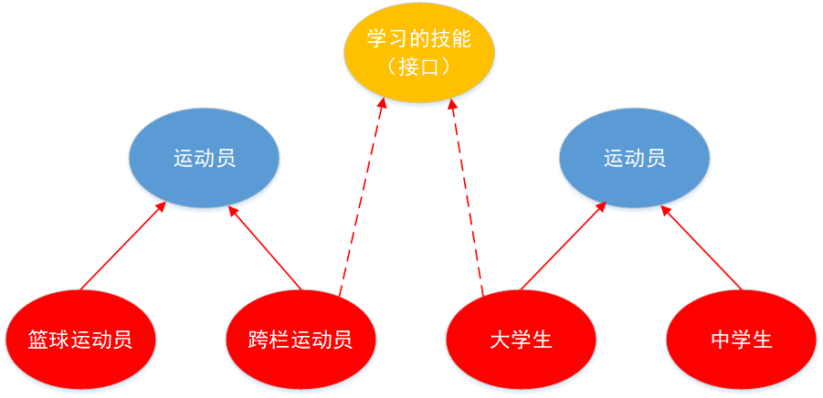

# 面向对象知识（补）

#### abstract关键字的使用

1. abstract：抽象的
2. abstract可以用来修饰的结构：类、方法
3. abstract修饰类：抽象类
   * 此类不能实例化
   * 抽象类中一定有构造器，便于子类实例化的时候调用（涉及：子类对象实例化的全过程）
   * 开发中。都会提供抽象类的子类，让子类对象实例化，完成相关的操作
4. abstract修饰方法，抽象方法
   * 抽象方法只有方法声明，没有方法实体
   * 包含抽象方法的类，一定是抽象类。反之，抽象类中可以没有抽象方法
   * 若子类重写了父类的所有的抽象方法后，此子类可以实例化； 若子类没有全部重写父类的抽象方法，子类也是一个抽象类，需要使用abstract修饰

**abstract使用上的注意点：**

* abstract不能用来修饰：属性、构造器等结构
* abstract不能用来修饰私有方法、静态方法、final的方法

**模板方法示例**

```java
public class TemplateMethodTest {
    public static void main(String[] args) {
        BankTemplateMethod btm1 = new DrawMoney();
        btm1.process();
        BankTemplateMethod btm2 = new ManageMoney();
        btm2.process();
    }
}

abstract class BankTemplateMethod {
    //具体方法
    public void takeNumber() {
        System.out.println("取号排队");
    }
    public abstract void transact();
    public void evaluate() {
        System.out.println("评分反馈");
    }
    //模板方法，把基本操作组合到一起，子类一般不能重写
    public final void process() {
        this.takeNumber();
        this.transact();//像钩子一样。具体执行时，挂在哪个子类，就执行哪个子类的实现代码
        this.evaluate();
    }
}

class DrawMoney extends BankTemplateMethod {
    @Override
    public void transact() {
        System.out.println("我要取款！");
    }
}

class ManageMoney extends BankTemplateMethod {
    @Override
    public void transact() {
        System.out.println("我要理财!");
    }
}

结果：
取号排队
我要取款！
评分反馈
取号排队
我要理财!
评分反馈
```

***

#### 接口(interface)

**概述：**

* 一方面，有时必须从几个类中派生出一个子类，继承它们所有的属性和方法。但是，Java不支持多重继承。有了接口，就可以得到多重继承的效果。
* 另一方面，有时必须从几个类中抽取出一些共同的行为特征，而它们之间又没有is-a的关系，仅仅是具有相同的行为特征而已。例如:鼠标、键盘、打印机、扫描仪、摄像头、充电器、MP3机、手机、数码相机、移动硬盘等都支持USB连接。
* 接口就是规范，定义的是一组规则，体现了现实世界中“如果你是/要...则必须能..”的思想。**继承是一个"是不是"的关系，而接口实现则是"能不能”的关系。** 
* **接口的本质是契约，标准，规范，** 就像我们的法律一样。制定好后大家都要遵守。



​	**接口的使用**

* 接口使用上也满足多态性
* 接口实际上就是一种规范
* 开发中，体会面向接口编程

```java
public class USBTest {
    public static void main(String[] args) {

        //方式一.创建了接口的非匿名实现类的非匿名对象
        Computer computer = new Computer();
        Flash flash = new Flash();
        computer.transferData(flash);
        //方式二.创建了接口的非匿名实现类的匿名对象
        computer.transferData(new Printer());

        //方式三.创建了接口的匿名实现类的非匿名对象
        USB phone = new USB() {
            @Override
            public void start() {
                System.out.println("手机开始工作");
            }

            @Override
            public void stop() {
                System.out.println("手机结束工作");
            }
        };
        computer.transferData(phone);

        //方式四.创建了接口的匿名实现类的匿名对象

        computer.transferData(new USB() {
            @Override
            public void start() {

                System.out.println("mp3开始工作");
            }

            @Override
            public void stop() {

                System.out.println("mp3结束工作");
            }
        });
    }
}

class Computer{

    public void transferData(USB usb){//USB usb = new Flash();
        usb.start();

        System.out.println("具体传输数据细节");

        usb.stop();
    }
}

interface USB{
    //常量：定义了长、宽、最大最小的传输速度等

    void start();

    void stop();

}

class Flash implements USB{

    @Override
    public void start() {
        System.out.println("U盘开启工作");
    }

    @Override
    public void stop() {
        System.out.println("U盘结束工作");
    }
}


class Printer implements USB{

    @Override
    public void start() {
        System.out.println("打印机开启工作");
    }

    @Override
    public void stop() {
        System.out.println("打印机结束工作");
    }
}

结果：
U盘开启工作
具体传输数据细节
U盘结束工作
打印机开启工作
具体传输数据细节
打印机结束工作
手机开始工作
具体传输数据细节
手机结束工作
mp3开始工作
具体传输数据细节
mp3结束工作
```

**接口的使用：静态代理模式**

```java
public class staticProxyTest {
    public static void main(String[] args) {
        RealStar realStar = new RealStar();
        Proxy proxy = new Proxy(realStar);
        proxy.confer();
        proxy.signContract();
        proxy.bookTicket();
        proxy.sing();
        proxy.collectMoney();
    }
}

interface Star{
    void confer();//面谈

    void signContract();//签合同

    void bookTicket();//订票

    void sing();//唱歌

    void collectMoney();//收钱
}

class RealStar implements Star{

    @Override
    public void confer() {

    }

    @Override
    public void signContract() {

    }

    @Override
    public void bookTicket() {

    }

    @Override
    public void sing() {
        System.out.println("明星自己唱歌！");
    }

    @Override
    public void collectMoney() {

    }
}

//代理类
class Proxy implements Star{

    private Star real;

    public Proxy(Star real) {
        this.real = real;
    }

    @Override
    public void confer() {
        System.out.println("经纪人面谈");
    }

    @Override
    public void signContract() {
        System.out.println("经纪人签合同");
    }

    @Override
    public void bookTicket() {
        System.out.println("经纪人订票");
    }

    @Override
    public void sing() {
        real.sing();
    }

    @Override
    public void collectMoney() {
        System.out.println("经纪人收钱");
    }
}

结果：
经纪人面谈
经纪人签合同
经纪人订票
明星自己唱歌！
经纪人收钱
```

