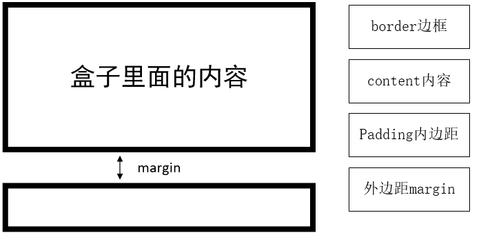

# CSS(Cascading Style Sheets)-网页的美容师

#### CSS的三大特性

* CSS有三个非常重要的特性：**层叠性、继承性、优先级**。

**一、层叠性**

* 解决样式冲突的问题
* 原则：
  * 样式冲突，遵循**就近原则**，哪个样式离结构近，就执行哪个样式
  * 样式不冲突，不会层叠。

**二、继承性**

* CSS中的继承：子标签会继承父标签的**某些**样式，如文本颜色和字号。
* 子元素可以继承父元素的样式（text-，font-，line-这些元素开头的都可以继承。以及color属性）
* 行高的继承性：`body { font: 12px/1.5 Microsotf  YaHei;}`
  * body行高1.5这样的写法最大的优势就是里面的子元素可以根据自己文字的大小自动调整行高。

**三、优先级**

* 选择器相同，则执行层叠性。

* 选择器不同，则根据**选择器权重**执行。

  * <table> 
        <thead>
            <tr>
            <th>选择器</th>
            <th>选择器权重</th>
        	</tr> 
        </thead>
        <tbody>
            <tr>
                <td>继承 或者 *</td>
                <td>0,0,0,0</td>
            </tr>
            <tr>
                <td>元素选择器</td>
                <td>0,0,0,1</td>
            </tr>
            <tr>
                <td>类选择器，伪类选择器</td>
                <td>0,0,1,0</td>
            </tr>
            <tr>
                <td>ID选择器</td>
                <td>0,1,0,0</td>
            </tr>
            <tr>
                <td>行内样式style=""</td>
                <td>1,0,0,0</td>
            </tr>
            <tr>
                <td>!important 重要的</td>
                <td>∞ 无穷大</td>
            </tr>
        </tbody>
    </table>

  * 继承的权重是**0**，如果该元素没有直接选中，不管父元素权重多高，子元素得到的权重都是0；

* 权重叠加：复合选择器有权重叠加的问题

***

#### 网页布局

* 网页布局要学习三大核心，盒子模型、浮动 和 定位。学好盒子模型可以非常好的帮助我们布局页面。
* 网页布局过程：
  * 先准备好相关的网页元素，网页元素基本都是盒子Box。
  * 利用CSS设置好盒子样式，然后拜访到相对应的位置。
  * 往盒子里面装内容
* 网页布局的核心本质：利用CSS摆盒子

**一、盒子模型**

* CSS盒子模型本质上是一个盒子，封装周围的HTML元素，他包括：边框、外边距、内边距和实际内容。

* 盒子模型的组成：

  * 

  * 边框（border）：边框的宽度（粗细）、边框样式、边框颜色。

    * `border : border-width || border-style || border-color`
    * 常用的border-style： solid：实线边框；dashed/dotted：虚线/点线边框
    * border-collapse: collapse --> 合并相邻边框

  * 内边距（padding）：属性用于设置内边距，即边框与内容之间的距离。

    * |           值的个数           |                          表达意思                          |
      | :--------------------------: | :--------------------------------------------------------: |
      |        padding: 5px;         |            1个值，代表上下左右都有5像素的内边距            |
      |      padding: 5px 10px;      |        2个值，代表上下内边距5像素，左右内边距10像素        |
      |    padding 5px 10px 20px;    | 3个值，代表上内边距5像素，左右内边距10像素，下内边距20像素 |
      | padding: 5px 10px 20px 30px; |  4个值，代表上5像素，右10像素，下20像素，左30像素。顺时针  |

    * 如果盒子本身没有指定width/height属性，则此时padding不会撑开盒子大小

  * 外边距（margin）：可以控制盒子和盒子之间的距离

    * 使用方法与padding相同
    * 典型运用：让**块级盒子水平居中**，但是必须满足两个条件：
      * 盒子必须指定宽度（width）
      * 盒子**左右的外边距**都设置为auto。
    * **注意：**以上方法是让块级元素水平居中，**行内元素或者行内块元素**水平居中**给其父元素添加text-align:center即可**
    * 外边距合并：使用margin定义块元素的垂直外边距时，可能会出现外边距合并。
      * **相邻块元素垂直外边距合并**：当上下相邻的两个块元素（兄弟关系）相遇时，如果上面的元素有下边距margin-bottom，下面的元素有上边距margin-top，则他们之间的**垂直间距不是margin-bottom与margin-top之和。取两个值中的较大者。**这种现象被称为**相邻块元素垂直外边距的合并**。-->解决方案：尽量只给一个盒子添加margin值。
      * **嵌套块元素垂直外边距的塌陷：** 对于两个嵌套关系（父子关系）的块元素，父元素有上外边距的同时，子元素也有上外边距，此时父元素会塌陷较大的外边距值。
        * 解决方案：
          * 可以给父元素定义上边框。boder: 1px solid transparent;
          * 可以给父元素定义上内边距。padding: 1px;
          * 可以给父元素添加overflow: hidden。
          * ........

  * 清除内外边距：`* {padding: 0;/*清除内边距*/ margin:0;/*清除外边距*/}`

  * **注意：行内元素为了照顾兼容性，尽量只设置左右内外边距，不要设置上下内外边距。但是转换为块级和行内块元就就可以了。**

