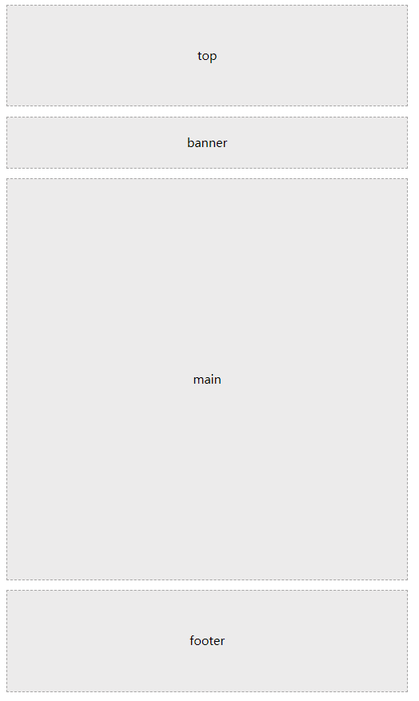
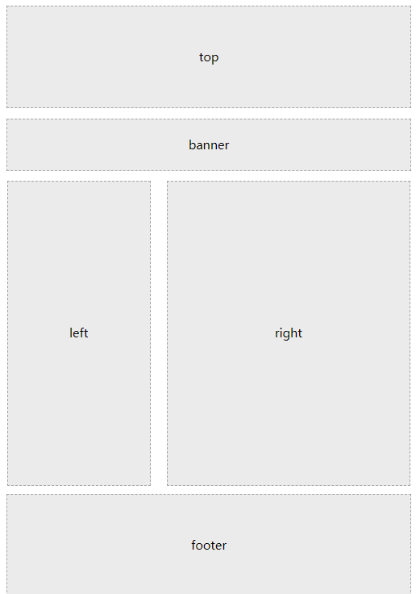
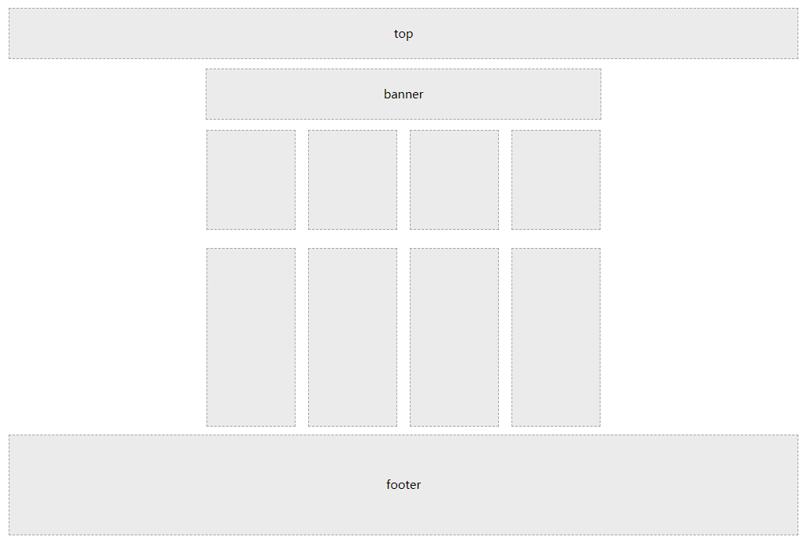

# CSS(Cascading Style Sheets)-网页的美容师

#### 常见的网页布局

* 
* 
* 

***

### CSS浮动

#### 一、传统网页布局的三种方式

* 网页布局的本质：用CSS来摆放盒子。把盒子摆放到相对应的位置
* CSS提供了三种传统布局方式：
  * 普通流（标准流）
  * 浮动
  * 定位

#### 二、标准流（普通流/文档流）：标签按照规定好的默认方式排列

* 块级元素独占一行，从上向下顺序排列。常用元素：div、hr、p、h1~h6、ul、ol、dl、form、table
* 行内元素按照顺序，从左到右顺序排列，碰到父元素边缘则自动换行。：span、a、i、em等

#### 三、浮动

* 浮动可以改变元素标签默认的排列方式。
* 典型应用：让多个块级元素一行内排列显示。
* **网页布局第一准则：多个块级元素纵向排列找标准流，多个块级元素横向排列找浮动**
* 语法：`选择器{ float：属性值;}` 
  * none：元素不浮动
  * left：元素向左浮动
  * right：元素向右浮动
* **浮动的特性（重难点）**
  * **浮动元素会脱离标准流（脱标）**
    * 脱离标准普通流的控制（浮），移动到指定位置（动）
    * 浮动的盒子**不再保留原先的位置** 
  * 浮动的元素会在一行内显示并且元素顶部对齐
    * 浮动的元素是相互贴靠在一起的（没有缝隙），如果父级宽度装不下这些浮动的盒子，多出的盒子会另起一行对齐
  * 浮动的元素会具有行内块元素的特性
    * 如果块级盒子没有设置宽度，默认宽度和父级一样宽，但是添加浮动之后，它的大小根据内容来决定
* 浮动元素经常和标准流父级搭配使用
  * 为了约束浮动元素位置，我们网页布局一般采取的策略是：
    * **先用标准流的父元素排列上下位置，之后内部子元素采取浮动排列左右位置，符合网页布局第一准则。**
* **网页布局第二准则：先设置盒子大小，之后设置盒子的位置。**
* **浮动布局注意点：**
  * 浮动和标准的父盒子搭配：先用标准流的父元素排列上下位置，之后内部子元素采取浮动排列左右位置。
  * 一个盒子浮动了，理论上其余的兄弟元素也要浮动：浮动的盒子只会影响浮动盒子后面的标准流，不会影响前面的标准流。

#### 四、清除浮动

* 由于父级盒子很多情况下，不方便给高度，但是盒子浮动又不占有位置，最后父级盒子高度为0时，就会影响下面的标准流盒子。

* 清除浮动的本质：

  * 清除浮动元素造成的影响。
  * 如果父盒子本身有高度，则不需要清除浮动
  * **清除浮动之后，父级就会根据浮动的子盒子自动检测高度，父级有了高度，就不会影响下面的标准流了**

* 语法：`选择器{clear:属性}`

  * left：不允许左侧有浮动（清除左侧浮动的影响）
  * right：不允许右侧有浮动（清除左侧浮动的影响）
  * **both：清除左右两侧浮动的影响--->基本上只用这个**

* 清除浮动方法：

  * **额外标签法**也称为隔墙法，是W3C推荐的做法

    * 在浮动元素末尾添加一个空标签。例如`<div style="clear:both"></div>`，或者其他标签（如`<br />`等）。
    * 优点：通俗易懂，方便书写
    * 缺点：添加许多无意义的标签，结构化较差
    * 注意：添加的新标签必须是块级元素

  * **父级添加overflow属性**

    * 可以给父级添加overflow属性，将其属性值设置为hidden、auto或scroll。
    * 优点：代码简洁
    * 缺点：无法显示溢出部分

  * **父级添加after伪元素**

    * :after方式是额外标签法的升级版，也是给父元素添加。

    * ```CSS
      .clearfix:after {
      	content: "";
      	display: block;
      	height: 0;
      	clear: both;
      	visibility: hidden;
      }
      
      .clearfix {/*IE6、7 专有*/
      	*zoom: 1;
      }
      ```

    * 优点：没有增加标签，结构简单

    * 缺点：照顾低版本浏览器

  * **父级添加双伪元素**

    * ```
      .clearfix:before,
      .clearfix:after {
      	content: "";
      	display: table;
      }
      
      .clearfix:after {
      	clear: both;
      }
      
      .clearfix {
      	*zoom: 1;
      }
      ```

***

