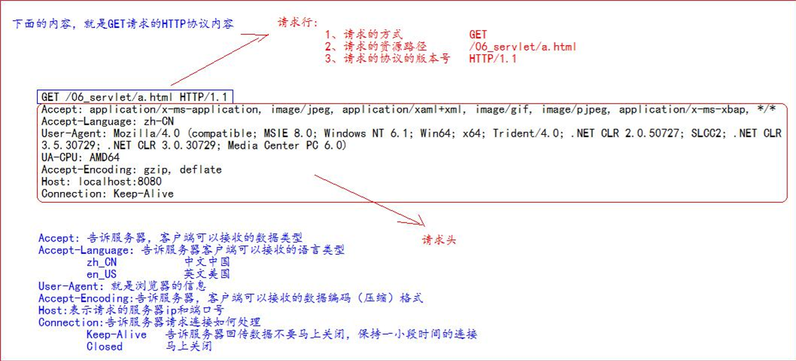
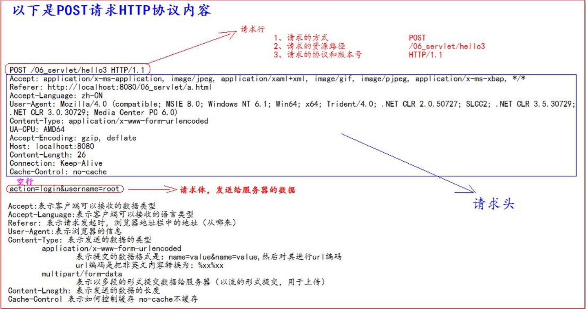
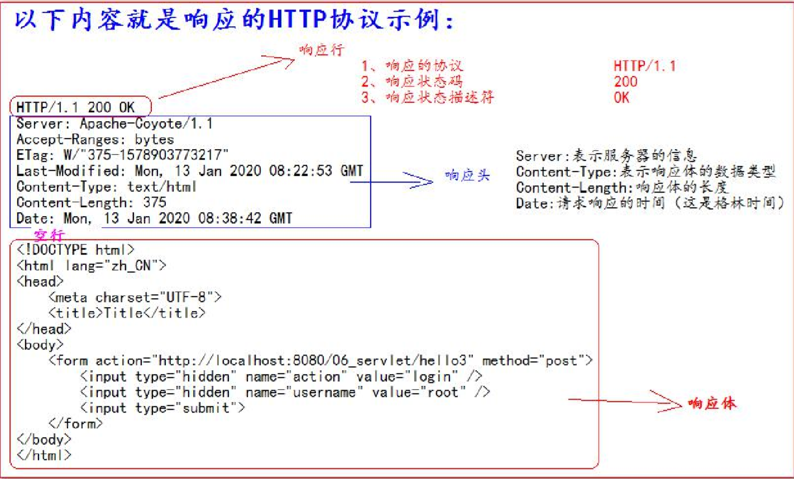

# Http协议

* 协议：双方或者多方，相互约定好，大家都要遵守的规则。
* http协议：客户端和服务器之间通信时，发送的数据，需要遵守的规则
* http协议中的数据又叫报文。


### 1. 请求的HTTP协议的格式

* 客户端给服务器发送数据叫请求。
* 服务器给客户端回传数据叫响应。
* 请求分成GET请求和POST请求


#### 1.1 GET请求

* 请求行：
  * 请求的方式：get
  * 请求的资源路径[+?+请求参数]
  * 请求的协议和版本号：HTTP/1.1
* 请求头：
  * key:value 组成，不同的键值对表示不同的含义。
* 


#### 1.2 POST请求

* 请求行：
  * 请求的方式：POST
  * 请求的资源路径[+?+请求参数]
  * 请求的协议版本号：HTTP/1.1
* 请求头：
  * key:value 组成，不同的键值对表示不同的含义。
* **空行**
* 请求体：发送给服务器的数据
* 


### 1.3 常见的请求头说明：

* Accept：表示客户端可以接收的数据类型 
* Accpet-Languege：表示客户端可以接收的语言类型 
* User-Agent：表示客户端浏览器的信息 
* Accept-Encoding：告诉服务器，客户端可以接收的数据编码（压缩）格式
* Host：表示请求时的服务器 ip 和端口号
* Connection：告诉服务器请求连接如何处理
  * Keep-Alive：告诉服务器回传数据不要马上关闭，保持一小段时间的连接
    * 


#### 1.4 GET请求和POST请求

* GET请求：
  * form 标签 method=get
  *  a 标签
  *  link 标签引入 css
  * Script 标签引入 js 文件
  * img 标签引入图片
  * iframe 引入 html 页面
  * 在浏览器地址栏中输入地址后敲回车
* POST请求：
  * form 标签 method=post


### 2. 响应的 HTTP 协议格式

* 响应行 
  * (1) 响应的协议和版本号 HTTP/1.1 
  * (2) 响应状态码 
  * (3) 响应状态描述符 
* 响应头
  *  (1) key:value 不同的响应头，有其不同含义 空行
* 响应体：就是回传给客户端的数据
* 


### 3. 常见的响应码

* 200：请求成功
* 302：请求重定向
* 404：表示请求服务器已经收到了，但是你要的数据不存在（请求地址错误） 
* 500：表示服务器已经收到请求，但是服务器内部错误（代码错误）


### 4. MIME 类型说明

* MIME 是 HTTP 协议中数据类型。 

* MIME 的英文全称是"MultipurposeInternetMailExtensions" 多功能 Internet 邮件扩充服务。

* MIME 类型的格式是“大类型/小 类型”，并与某一种文件的扩展名相对应。

* 常见的 MIME 类型：

  * |        文件        | MIME类型                                      |
    | :----------------: | :-------------------------------------------- |
    | 超文本标记语言文本 | .html,.htm            text/html               |
    |      普通文本      | .txt                         text/plain       |
    |      RTF文本       | .rtf                         application/rtf  |
    |      GIF图形       | .gif                         image/gif        |
    |      JPEG图形      | .jpeg, .jpg             image/jpeg            |
    |     au声音文件     | .au                        audio/basic        |
    |    MIDI音乐文件    | mid, /midi           audio/midi, audio/x-midi |
    | RealAudio音乐文件  | .ra .ram               audio/x-pn-realaudio   |
    |    MPEG音乐文件    | .mpg, .mpeg       video/mpeg                  |
    |      AVI文件       | .avi                       video/x-msvideo    |
    |      GZIP文件      | .gz                        application/x-gzip |
    |      TAR文件       | .tar                       application/x-tar  |

***

# HttpServletRequest类

### 1. HttpServletRequest类的作用

* 每次只要有请求进入 Tomcat 服务器，Tomcat 服务器就会把请求过来的 HTTP 协议信息解析好封装到 Request 对象中。 
* 然后传递到 service 方法（doGet 和 doPost）中给我们使用。我们可以通过 HttpServletRequest 对象，获取到所有请求的信息。


### 2. HttpServletRequest 类的常用方法

* getRequestURI() 获取请求的资源路径
* getRequestURL() 获取请求的统一资源定位符（绝对路径）
* getRemoteHost() 获取客户端的 ip 地址
* getHeader() 获取请求头
* getParameter() 获取请求的参数
* getParameterValues() 获取请求的参数（多个值的时候使用）
* getMethod() 获取请求的方式 GET 或 POST
* setAttribute(key, value); 设置域数据 
* getAttribute(key); 获取域数据
* getRequestDispatcher() 获取请求转发对 


### 3. 如何获取请求参数

* 表单

  * ```html
    <body> 
        <form action="http://localhost:8080/07_servlet/parameterServlet" method="get"> 		   用户名：<input type="text" name="username"><br/>
    		密码：<input type="password" name="password"><br/>
            兴趣爱好：
            <input type="checkbox" name="hobby" value="cpp">C++
            <input type="checkbox" name="hobby" value="java">Java 
            <input type="checkbox" name="hobby" value="js">JavaScript<br/> 
            <input type="submit"> 
        </form> 
    </body>
    ```

* Java

  * ```java
    public class ParameterServlet extends HttpServlet {
    	@Override 
        protected void doGet(HttpServletRequest req, HttpServletResponse resp) throws ServletException, IOException { 
            // 获 取 请 求 参 数 
            String username = req.getParameter("username"); 
            String password = req.getParameter("password"); 
            String[] hobby = req.getParameterValues("hobby");
            System.out.println("用户名：" + username); 
            System.out.println("密码：" + password); 
            System.out.println("兴趣爱好：" + Arrays.asList(hobby));
        }
    }
    ```


### 4. 中文乱码

* doGet 请求的中文乱码解决:

  * ```java
        //获 取 请 求 参 数 
        String username = req.getParameter("username");
        //1先 以 iso8859-1进 行 编 码
        //2再 以 utf-8进 行 解 码 
        username = new String(username.getBytes("iso-8859-1"), "UTF-8");
    ```

* POST 请求的中文乱码解决:

  * ```
    	@Override 
        protected void doGet(HttpServletRequest req, HttpServletResponse resp) throws ServletException, IOException { 
        	//设置请求体的字符集为UTF-8 ， 从而解决 post请求的中文乱码问题
            req.setCharacterEncoding("UTF-8"); 
            System.out.println("-------------doPost------------")
            // 获 取 请 求 参 数 
            String username = req.getParameter("username"); 
            String password = req.getParameter("password"); 
            String[] hobby = req.getParameterValues("hobby");
            System.out.println("用户名：" + username); 
            System.out.println("密码：" + password); 
            System.out.println("兴趣爱好：" + Arrays.asList(hobby));
        }
    ```


### 5. 请求的转发

* 请求转发是指，服务器收到请求后，从一次资源跳转到另一个资源的操作叫请求转发。


#### 5.1 请求转发的特点

* 浏览器地址栏没有变化
* 他们是一次请求
* 他们共享Request域中的数据
* 可以转发到WEB-INF目录下


### 6. web中 / 斜杠的不同意义

* 在web中 / 斜杠 是一种绝对路径
* / 斜杠被浏览器解析，得到的地址是：http://ip:port/
  * `<a href="/">斜杠</a>`
* / 斜杠被服务器解析，得到的地址是：http://ip:port/工程路径
  * `<url-pattern>/servlet</url-pattern>`
  * servletContext.getRealPath("/");
  * request.getRequestDispatcher("/");
* 特殊情况：(请求重定向)
  * response.sendRediect("/");    --->把斜杠发送给浏览器解析，得到http://ip:port/

