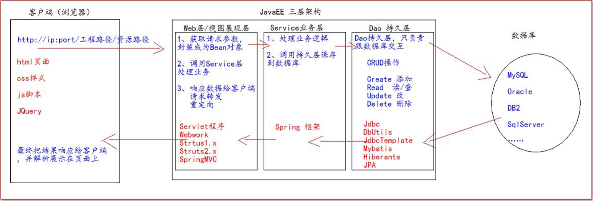

# HttpServletResponse

### 1. HttpServletResponse类的作用

* HttpServletResponse 类和 HttpServletRequest 类一样，每次请求进来，Tomcat服务器都会创建一个 Response对象传递给 Servlet 程序去使用。 
* HttpServletRequest 表示请求过来的信息，HttpServletResponse 表示所有响应的信息。我们如果需要设置返回给客户端的信息，都可以通过 HttpServletResponse 对象来进行设置。


### 2. 两个输出流

* 字节流：getOutputStream()
  * 常用于下载，传递二进制数据
* 字符流：getWriter()
  * 常用于回传字符串（常用）
* 两个流同时只能使用一个。


### 3. 客户端往回传数据

* 中文乱码的解决方式一：

  * ```
            //设置服务器字符集为UTF-8  要是仍然乱码，则是浏览器的编码不正确。为GDK
            resp.setCharacterEncoding("UTF-8");
    
            //通过响应头。设置浏览器也使用UTF-8字符集
            resp.setHeader("Content-Type","text/html; charset=UTF-8");
    ```

* 中文乱码的解决方式二：

  * ```
            //同时设置服务器和浏览器都使用UTF-8字符集，还设置了响应头
            //注意：此方法一定要在获取流对象之前调用才有效
            resp.setContentType("text/html; charset=UTF-8");
    ```

  * 注意：此方法一定要在获取流对象之前调用才有效

* 回传数据的方式：

  * ```
            //两个只能存在一个
    //        resp.getOutputStream();
            PrintWriter writer = resp.getWriter();
            writer.write("response's content  哈拉少666");
    ```


### 4. 请求重定向

* 请求重定向，是指客户端给服务器发送请求，然后服务器告诉客户端，给一个新地址，去访问新地址。叫请求重定向(因为之前的地址可能已经被废弃)

* 特点：

  * 地址栏会发生变化
  * 两次请求
  * 不共享 Request 域中的数据
  * 不能访问 WEB-INF 下的资源，可以访问工程外的资源

* 请求重定向方式一：

  * ```java
            //设置响应状态码 302  表示重定向（已搬迁）
            resp.setStatus(302);
            //设置响应头，说明新的地址在哪里
            resp.setHeader("Location","http://localhost:8080/0727web/response2");
    ```

* 请求重定向方式二（**推荐**）：

  * ```java
            resp.sendRedirect("http://localhost:8080/0727web/response2");
    ```

***

# JavaEE

### 1. 三层架构



* 分成的目的：分层的目的是为了解耦。解耦就是为了降低代码的耦合度。方便项目后期的维护和升级。
* web 层 
  * web/servlet/controller 
* service 层 
  * service Service 接口包 
  * service.impl Service 接口实现类 
* dao 持久层 
  * dao Dao 接口包 
  * dao.impl Dao 接口实现类 
* 实体 bean 对象 
  * pojo/entity/domain/bean JavaBean 类 
* 测试包：test/junit 
* 工具类：utils

***

### 2. 数据库连接池

* 数据库连接配置文件

  * ```
     文件名称：
    jdbc.properties
    内容：
    username=root
    password=root
    url=jdbc:mysql://localhost:3306/book
    driverClassName=com.mysql.jdbc.Driver
    initialSize=5
    maxActive=10
    ```

* 连接java文件

  * ```java
    public class JdbcUtils {
    
        private static DruidDataSource dataSource;
    
        //代码块初始化
        static {
    
            try {
                Properties properties = new Properties();
                //读取 jdbc.properties 属性配置文件
                InputStream inputStream = JdbcUtils.class.getClassLoader().getResourceAsStream("jdbc.properties");
                properties.load(inputStream);
                dataSource = (DruidDataSource) DruidDataSourceFactory.createDataSource(properties);
            } catch (Exception e) {
                e.printStackTrace();
            }
        }
    
        /**
         * 获取数据库连接池中的连接
         * 返回null，说明获取连接失败
         * @return
         */
        public static Connection getConnection(){
            Connection conn = null;
            try {
                conn = dataSource.getConnection();
            } catch (Exception e) {
                e.printStackTrace();
            }
            return conn;
        }
    
        /**
         * 关闭连接，返回连接池
         * @param connection
         */
    
        public static void close(Connection connection){
            if (connection != null){
                try {
                    connection.close();
                } catch (Exception e) {
                    e.printStackTrace();
                }
            }
        }
    }
    ```

***

### 3. BaseDao类

* 封装一些对SQL的操作。

```java
public abstract class BaseDao {

    //使用 Dbutils 操作数据库
    private QueryRunner queryRunner = new QueryRunner();


    /**
     * update() 方法用来执行：insert、update、delete 语句
     * @return 返回-1说明执行失败，返回其他表示影响的行数
     */
    public int update(String sql,Object ... args){
        Connection connection = JdbcUtils.getConnection();
        try {
            //返回影响的行数
            return queryRunner.update(connection,sql,args);
        } catch (SQLException e) {
            e.printStackTrace();
        } finally {
            JdbcUtils.close(connection);
        }
        return -1;
    }

    /**
     * 查询返回一个 JavaBean 的sql语句
     * @param type 返回的对象类型
     * @param sql 执行的SQL语句
     * @param args SQL对应的参数值
     * @param <T> 返回的类型的泛型
     * @return
     */
    
    public <T> T queryForOne(Class<T> type,String sql,Object ... args){
        Connection connection = JdbcUtils.getConnection();
        try {
            return queryRunner.query(connection,sql,new BeanHandler<T>(type),args);
        } catch (SQLException e) {
            e.printStackTrace();
        } finally {
            JdbcUtils.close(connection);
        }
        return null;
    }

    /**
     * 查询返回多个 JavaBean 的sql语句
     * @param type 返回的对象类型
     * @param sql 执行的SQL语句
     * @param args SQL对应的参数值
     * @param <T> 返回的类型的泛型
     * @return
     */
    
    public <T> List<T> queryForList(Class<T> type, String sql, Object ... args){
        Connection connection = JdbcUtils.getConnection();
        try {
            return queryRunner.query(connection,sql,new BeanListHandler<>(type),args);
        } catch (SQLException e) {
            e.printStackTrace();
        } finally {
            JdbcUtils.close(connection);
        }
        return null;
    }


    /**
     * 执行返回一行一列的 SQL 语句
     * @param sql SQL语句
     * @param args SQL对应的参数
     * @return 
     */
    public Object queryForSingleValue(String sql, Object ... args){
        Connection connection = JdbcUtils.getConnection();
        try {
            return queryRunner.query(connection,sql,new ScalarHandler(),args);
        } catch (SQLException e) {
            e.printStackTrace();
        } finally {
            JdbcUtils.close(connection);
        }
        return null;
    }
    
    
}
```

***

### 4. 编写 UserDao 和 测试

#### 4.1 DAO接口

```java
public interface UserDao {
    //根据用户名查询用户信息
    public User queryUserByUsername(String username);

    //根据用户名和密码查询用户信息
    public User queryUserByUsernameAndPassword(String username,String password);

    //保存用户信息
    public int saveUser(User user);

}
```


#### 4.2 DAO接口实现类

```java
public class UserDaoImpl extends BaseDao implements UserDao {
    @Override
    public User queryUserByUsername(String username) {
        String sql = "select `id`,`username`,`password`,`email` from t_user where username = ? ";
        return queryForOne(User.class,sql,username);
    }

    @Override
    public User queryUserByUsernameAndPassword(String username, String password) {

        String sql = "select `id`,`username`,`password`,`email` from t_user where username = ? and password = ? ";
        return queryForOne(User.class,sql,username,password);
    }

    @Override
    public int saveUser(User user) {
        String sql = "INSERT INTO t_user(`username`,`password`,`email`) VALUES (?,?,?)";
        return update(sql,user.getUsername(),user.getPassword(),user.getEmail());
    }
}
```


#### 4.3 测试类

* 在 **接口类** 按快捷键：ctrl + shift + T 快速生成测试类

```
public class UserDaoTest {

    UserDao userDao = new UserDaoImpl();

    @Test
    public void queryUserByUsername() {
//        System.out.println(userDao.queryUserByUsername("admin"));
        if (userDao.queryUserByUsername("admin") == null){
            System.out.println("用户名可以使用");
        }else {
            System.out.println("用户名存在");
        }
    }

    @Test
    public void queryUserByUsernameAndPassword() {
        if(userDao.queryUserByUsernameAndPassword("admin","123456") == null){
            System.out.println("用户名账号或者密码错误");
        }else {
            System.out.println("登录成功");
        }
    }

    @Test
    public void saveUser() {
        System.out.println(userDao.saveUser(new User(null, "admin123", "112233", "user@163.com")));
    }
}
```

***

### 5. 编写 UserService 和测试

#### 5.1 Service接口

```java
public interface UserService {

    /**
     * 用户注册
     * @param user
     */
    public void registerUser(User user);

    /**
     * 用户登录
     * @return
     */
    public User login(User user);

    /**
     * 检查用户名是否可用
     * @param username
     * @return true 表示用户名存在 ， false 表示用户名可用
     */
    public boolean existUsername(String username);

}
```


#### 5.2 Service接口实现类

```java
public class UserServiceImpl implements UserService {

    private UserDao userDao = new UserDaoImpl();


    @Override
    public void registerUser(User user) {
        userDao.saveUser(user);
    }

    @Override
    public User login(User user) {
        return userDao.queryUserByUsernameAndPassword(user.getUsername(),user.getPassword());
    }

    @Override
    public boolean existUsername(String username) {

        if (userDao.queryUserByUsername(username) == null){
            //没查到表示可以使用
            return false;
        }
        return true;
    }
}
```


#### 5.3 测试类

* 在  **接口类**  按快捷键：ctrl + shift + T 快速生成测试类

```java
public class UserServiceTest {

    UserService userService = new UserServiceImpl();

    @Test
    public void registerUser() {
        userService.registerUser(new User(null,"admin02","aabb22","admin02@126.com"));
        userService.registerUser(new User(null,"admin03","aabb22","admin03@126.com"));
    }

    @Test
    public void login() {
        System.out.println(userService.login(new User(null, "admin02", "aabb22", "admin02@126.com")));
        System.out.println(userService.login(new User(null, "admin052", "aabb22", "admin02@126.com")));
    }

    @Test
    public void existUsername() {
        System.out.println(userService.existUsername("admin02"));
        System.out.println(userService.existUsername("admin0f2"));
    }
}
```

