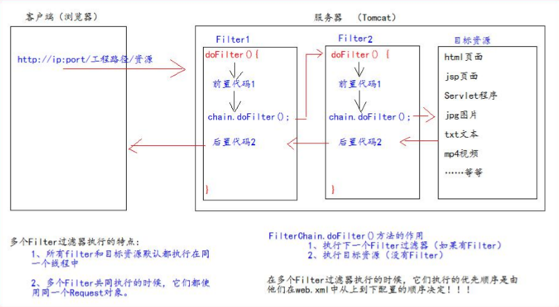

## Filter

* Filter 过滤器它是 JavaWeb 的三大组件之一。三大组件分别是：Servlet 程序、Listener 监听器、Filter 过滤器 
* Filter 过滤器它是 JavaEE 的规范。也就是接口 
* Filter 过滤器它的作用是：拦截请求，过滤响应。
  * 拦截请求常见的应用场景有： 
    * 权限检查 
    * 日记操作 
    * 事务管理
    *  ……等等


### 1.使用步骤

* 编写一个类去实现 Filter 接口 

  * `public class AdminFilter implements Filter `

* 实现过滤方法 doFilter() 

  * ```java
        @Override
        public void doFilter(ServletRequest servletRequest, ServletResponse servletResponse, FilterChain filterChain) throws IOException, ServletException {
            HttpServletRequest httpServletRequest = (HttpServletRequest) servletRequest;
    
            Object user = httpServletRequest.getSession().getAttribute("user");
            if (user == null){
                //判断用户是否登录，没有登录就跳转到登录界面
                httpServletRequest.getRequestDispatcher("/pages/user/login.jsp")
                .forward(servletRequest,servletResponse);
            }else {
                //登录就继续执行
                filterChain.doFilter(servletRequest,servletResponse);
            }
    
        }
    ```

* 到 web.xml 中去配置 Filter 的拦截路径

  * ```xml
        <filter>
            <!--别名-->
            <filter-name>AdminFilter</filter-name>
            <!--全类名-->
            <filter-class>com.lyb.filter.AdminFilter</filter-class>
        </filter>
        <filter-mapping>
            <!--当前拦截路径给哪个filter使用-->
            <filter-name>AdminFilter</filter-name>
            <!--拦截路径-->
            <!-- / 表示请求地址为：http://ip:port/工程路径/ 映射到web目录 可以设置多个路径-->
            <url-pattern>/pages/manager/*</url-pattern>
            <url-pattern>/manager/bookServlet</url-pattern>
        </filter-mapping>
    ```


### 2. Filter生命周期

* Filter 的生命周期包含几个方法 
  * 构造器方法 
  * init 初始化方法 
    * 以上两步在 web 工程启动的时候执行（Filter 已经创建）
  * doFilter 过滤方法 
    * 每次拦截到请求，就会执行
  * destroy 销毁
    * 停止 web 工程的时候，就会执行(停止 web 工程，也会销毁 Filter 过滤器)


### 3. FilterConfig 类

* FilterConfig 类见名知义，它是 Filter 过滤器的配置文件类。 
* Tomcat 每次创建 Filter 的时候，也会同时创建一个 FilterConfig 类，这里包含了 Filter 配置文件的配置信息。
* FilterConfig 类的作用是获取 filter 过滤器的配置内容 
  * 获取 Filter 的名称 filter-name 的内容 
  * 获取在 Filter 中配置的 init-param 初始化参数 
  * 获取 ServletContext 对象

```java
	@Override 
	public void init(FilterConfig filterConfig) throws ServletException {
        System.out.println("2.Filter 的 init(FilterConfig filterConfig)初始化");
		//1、获取 Filter 的名称 filter-name 的内容
        System.out.println("filter-name 的值是：" + filterConfig.getFilterName());
        //2、获取在 web.xml 中配置的 init-param 初始化参数
        System.out.println("初始化参数 username 的值是："+filterConfig.getInitParameter("username")); 
        System.out.println("初始化参数 url 的值是：" + filterConfig.getInitParameter("url")); 
        //3、获取 ServletContext 对象
        System.out.println(filterConfig.getServletContext()); }
```

```xml
    <filter>
        <!--别名-->
        <filter-name>AdminFilter</filter-name>
        <!--全类名-->
        <filter-class>com.lyb.filter.AdminFilter</filter-class>
        <!--配置参数-->
        <init-param>
            <param-name>username</param-name>
            <param-value>root</param-value>
        </init-param>
        <init-param>
            <param-name>url</param-name>
            <param-value>jdbc:mysql:///test</param-value>
        </init-param>
    </filter>
```


### 4. FilterChain 过滤器链

* Filter 过滤器
*  Chain 链，
* 链条 FilterChain 就是过滤器链（多个过滤器如何一起工作）




### 5. Filter拦截路径

* 精确匹配
  * `<url-pattern>/target.jsp</url-pattern> `
  * 以上配置的路径，表示请求地址必须为：`http://ip:port/工程路径/target.jsp`
* 目录匹配
  * `<url-pattern>/admin/*</url-pattern> `
  * 以上配置的路径，表示请求地址必须为：` http://ip:port/工程路径/admin/*`
* 后缀名匹配
  * `<url-pattern>*.html</url-pattern> `
  * 以上配置的路径，表示请求地址必须以`.html`结尾才会拦截到
  * ` <url-pattern>*.do</url-pattern> `
  * 以上配置的路径，表示请求地址必须以`.do `结尾才会拦截到 
  *  `<url-pattern>*.action</url-pattern>`
  *  以上配置的路径，表示请求地址必须以`.action `结尾才会拦截到
* Filter 过滤器它只关心请求的地址是否匹配，不关心请求的资源是否存在！