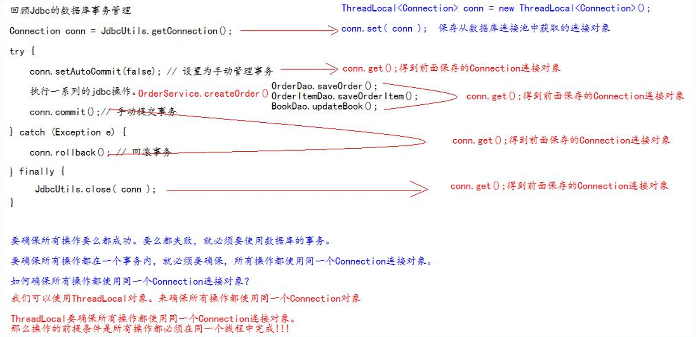

## ThreadLocal 

* ThreadLocal 的作用：它可以解决多线程的数据安全问题。
* ThreadLocal 它可以给当前线程关联一个数据（可以是普通变量，可以是对象，也可以是数组，集合）
* ThreadLocal 的特点：
  *  ThreadLocal 可以为当前线程关联一个数据。（它可以像 Map 一样存取数据，key 为当前线程） 
  * 每一个 ThreadLocal 对象，只能为当前线程关联一个数据，如果要为当前线程关联多个数据，就需要使用多个 ThreadLocal 对象实例。 
  * 每个 ThreadLocal 对象实例定义的时候，一般都是 static 类型 
  * ThreadLocal 中保存数据，在线程销毁后。会由 JVM 虚拟自动释放


### 1. 使用 Filter 和 ThreadLocal 组合管理事务




#### 1.1 jdbcUtils 工具类修改

```java
 private static DruidDataSource dataSource;
    private static ThreadLocal<Connection> conns = new ThreadLocal<>();

    //代码块初始化
    static {

        try {
            Properties properties = new Properties();
            //读取 jdbc.properties 属性配置文件
            InputStream inputStream = JdbcUtils.class.getClassLoader().getResourceAsStream("jdbc.properties");
            properties.load(inputStream);
            dataSource = (DruidDataSource) DruidDataSourceFactory.createDataSource(properties);

        } catch (Exception e) {
            e.printStackTrace();
        }
    }

    /**
     * 获取数据库连接池中的连接
     * 返回null，说明获取连接失败
     * @return
     */
    public static Connection getConnection(){
        Connection conn = conns.get();

        if (conn == null){
            try {
                //从数据库池获取连接
                conn = dataSource.getConnection();
                //存储到ThreadLocal中
                conns.set(conn);
                //关闭自动提交
                conn.setAutoCommit(false);
            } catch (SQLException e) {
                e.printStackTrace();
            }
        }
        return conn;
    }

    /**
     * 提交事务，关闭释放连接
     */
    public static void commitAndClose(){
        Connection conn = conns.get();
        if (conn != null){
            try {
                //手动提交
                conn.commit();
                //重新设置为自动提交
                conn.setAutoCommit(true);
            } catch (SQLException e) {
                e.printStackTrace();
            }finally {
                try {
                    //关闭连接
                    conn.close();
                } catch (SQLException e) {
                    e.printStackTrace();
                }
            }
        }
        //一定要remove，否则会出错
        conns.remove();
    }

    /**
     * 回滚事务，并关闭释放连接
     */
    public static void rollbackAndClose(){
        Connection conn = conns.get();
        if (conn != null){
            try {
                //手动提交
                conn.rollback();
                //重新设置为自动提交
                conn.setAutoCommit(true);
            } catch (SQLException e) {
                e.printStackTrace();
            }finally {
                try {
                    //关闭连接
                    conn.close();
                } catch (SQLException e) {
                    e.printStackTrace();
                }
            }
        }
        //一定要remove，否则会出错
        conns.remove();
    }
}
```


#### 1.2 修改BaseDao

**修改前**

```java
    /**
     * update() 方法用来执行：insert、update、delete 语句
     * @return 返回-1说明执行失败，返回其他表示影响的行数
     */
    public int update(String sql,Object ... args){
        Connection connection = JdbcUtils.getConnection();
        try {
            //返回影响的行数
            return queryRunner.update(connection,sql,args);
        } catch (SQLException e) {
            e.printStackTrace();
        } finally {
            JdbcUtils.close(connection);
        }
        return -1;
    }
```

**修改后**：不关闭连接，抛出捕获的异常

```java
    /**
     * update() 方法用来执行：insert、update、delete 语句
     * @return 返回-1说明执行失败，返回其他表示影响的行数
     */
    public int update(String sql,Object ... args){
        Connection connection = JdbcUtils.getConnection();
        try {
            //返回影响的行数
            return queryRunner.update(connection,sql,args);
        } catch (SQLException e) {
            e.printStackTrace();
            throw new RuntimeException(e);
        }
    }
```


#### 1.3 修改BaseServlet程序

* 把 BaseServlet 中的异常往外抛给 Filter 过滤器 

```java
	@Override
    protected void doPost(HttpServletRequest req, HttpServletResponse resp) throws ServletException, IOException {

        //一定要在获取请求参数之前调用才有效
        req.setCharacterEncoding("UTF-8");
        String action = req.getParameter("action");
//        if ("login".equals(action)){
//            login(req,resp);
//        }else if ("regist".equals(action)){
//            regist(req,resp);
//        }
        //通过反射直接调用 目标业务 的方法
        try {
            Method method = this.getClass().getDeclaredMethod(action, HttpServletRequest.class, HttpServletResponse.class);
            method.invoke(this, req, resp);
        } catch (Exception e) {
            e.printStackTrace();
            //这里的异常也要抛出，给Filter捕获
            throw new RuntimeException(e);
        }
    }
```


#### 1.4 新建Filter类

```java
public class TransactionFilter implements Filter {
    @Override
    public void init(FilterConfig filterConfig) throws ServletException {
    }

    @Override
    public void doFilter(ServletRequest servletRequest, ServletResponse servletResponse, FilterChain filterChain) throws IOException, ServletException {
        try {
            filterChain.doFilter(servletRequest,servletResponse);
            //提交事务
            JdbcUtils.commitAndClose();
        } catch (Exception e) {
            //出现异常，回滚事务
            JdbcUtils.rollbackAndClose();
            e.printStackTrace();
            //抛出异常，给Tomcat统一展示错误界面
            throw new RuntimeException(e);
        }
    }
    @Override
    public void destroy() {

    }
}
```

* web.xml配置

```xml
    <filter>
        <filter-name>TransactionFilter</filter-name>
        <filter-class>com.lyb.filter.TransactionFilter</filter-class>
    </filter>

    <filter-mapping>
        <filter-name>TransactionFilter</filter-name>
        <!--所有请求都捕获-->
        <url-pattern>/*</url-pattern>
    </filter-mapping>
```


#### 1.5 将所有异常都统一交给 Tomcat，让 Tomcat 展示友好的错误信息页面。

* web.xml配置

```xml
    <error-page>
        <!--错误代码-->
        <error-code>500</error-code>
        <!--错误跳转路径-->
        <location>/pages/error/error500.jsp</location>
    </error-page>

    <error-page>
        <error-code>404</error-code>
        <location>/pages/error/error404.jsp</location>
    </error-page>
```

***

## JSON和Ajax

### 1. JSON

* JSON (JavaScript Object Notation) 是一种轻量级的数据交换格式。易于人阅读和编写。同时也易于机器解析和生成。JSON 采用完全独立于语言的文本格式，而且很多语言都提供了对 json 的支持（包括 C, C++, C#, Java, JavaScript, Perl, Python 等）。 这样就使得 JSON 成为理想的数据交换格式。
* json 是一种轻量级的数据交换格式。
* 轻量级指的是跟 xml 做比较。
* 数据交换指的是客户端和服务器之间业务数据的传递格式


#### 1.1 json在JavaScript中的使用

* 一般我们要操作 json 中的数据的时候，需要 json 对象的格式。 
* 一般我们要在客户端和服务器之间进行数据交换的时候，使用 json 字符串。

```html
		<script type="text/javascript">
			// json的定义
			var jsonobject = {
			    "key1":123	,
				"key2":"abc"
			};
			// json的访问
			alert(jsonobject.key1);//123
			// json对象转字符串 JSON.stringify():把 json 对象转换成为 json 字符串
			var jsonstring = JSON.stringify(jsonobject);
			alert(jsonstring);//{"key1":123,"key2":"abc"}
			// json字符串转json对象 JSON.parse():把 json 字符串转换成为 json 对象
			var jsonobj2 = JSON.parse(jsonstring);
			alert(jsonobj2);//[object Object]
		</script>
```


#### 1.2 json在java中的使用

* 我们要使用json 和java中使用，我们需要使用到一个第三方的包。它就是 gson.jar。

##### 1. javaBean 和 json 的互转

```java
    /**
     * javaBean 和 json 的互转
     */
    @Test
    public void test1(){
        Person person = new Person(1, "年少，白了头");
        System.out.println("person : " + person);
        //创建Gson对象实例
        Gson gson = new Gson();
        //调用toJson()方法把java对象转换为json字符串
        String personstring = gson.toJson(person);
        System.out.println("personstring : " + personstring);
        //调用fromJson()方法转换为java对象
        Person person1 = gson.fromJson(personstring, Person.class);
        System.out.println("person1 : "+person1);

    }
```

##### 2. List 和 json 的互转

```java
    /**
     * List 和 json 的互转
     */
    @Test
    public void test2(){
        List<Person> list = new ArrayList<>();
        list.add(new Person(1,"男人"));
        list.add(new Person(2,"至死是少年"));
        System.out.println("list : " + list);
        Gson gson = new Gson();
        //把list转换成 json 字符串
        String liststring = gson.toJson(list);
        System.out.println("liststring : " + liststring);
        //把 json字符串 转换为list
        //通过匿名内部类方式创建 TypeToken 类，并调用getType()方法得到Type对象
        Type type = new TypeToken<List<Person>>(){}.getType();
        //将 json字符串和type传入fromJson()方法中
        List<Person> list1 = gson.fromJson(liststring, type);
        System.out.println("list1 : " + list1);
    }
```

##### 3. Map 和 json 的互转

```java
 	/**
     * Map 和 json 的互转
     */
    @Test
    public void test3(){
        Map<Integer,String> map = new HashMap<>();
        map.put(1,"男人");
        map.put(2,"至死是少年");
        System.out.println("list : " + map);
        Gson gson = new Gson();
        //把list转换成 json 字符串
        String mapstring = gson.toJson(map);
        System.out.println("mapstring : " + mapstring);
        //把 json字符串 转换为list
        //通过匿名内部类方式创建 TypeToken 类，并调用getType()方法得到Type对象
        Type type = new TypeToken<Map<Integer,String>>(){}.getType();
        //将 json字符串和type传入fromJson()方法中
        Map<Integer,String> map1 = gson.fromJson(mapstring, type);
        System.out.println("map1 : " + map1);
    }
```

***

### 2. Ajax

* AJAX 即“Asynchronous Javascript And XML”（异步 JavaScript 和 XML），是指一种创建交互式网页应用的 网页开发技术。
* ajax 是一种浏览器异步发起请求。局部更新页面的技术。


#### 2.1 javaScript 原生 Ajax 请求

* 原生的 Ajax 请求
  * 我们首先要创建 XMLHttpRequest 对象
  * 调用open方法设置请求参数 
  * 调用send方法发送请求
  * 在send方法前绑定onreadystatechange 事件，处理请求完成后的操作


* html页面

```html
<!DOCTYPE html PUBLIC "-//W3C//DTD HTML 4.01 Transitional//EN" "http://www.w3.org/TR/html4/loose.dtd">
<html>
	<head>
		<meta http-equiv="pragma" content="no-cache" />
		<meta http-equiv="cache-control" content="no-cache" />
		<meta http-equiv="Expires" content="0" />
		<meta http-equiv="Content-Type" content="text/html; charset=UTF-8">
		<title>Insert title here</title>
		<script type="text/javascript">
			function ajaxRequest() {
				// 1、我们首先要创建XMLHttpRequest
				var xhr = new XMLHttpRequest();
				// 2、调用open方法设置请求参数
				xhr.open("GET","http://localhost:8080/0816web/ajaxServlet?action=javaScriptAjax",true)
                // 4、在send方法前绑定onreadystatechange事件，处理请求完成后的操作。
				xhr.onreadystatechange = function () {
				    if (xhr.readyState == 4 && xhr.status == 200){
				        var jsonobj = JSON.parse(xhr.responseText);

				        document.getElementById("div01").innerText = "编号: " + jsonobj.id + " ,姓名： " + jsonobj.name;
					}
				}
				// 3、调用send方法发送请求
				xhr.send();
			}
		</script>
	</head>
	<body>	
		<button onclick="ajaxRequest()">ajax request</button>
		<div id="div01">
		</div>
	</body>
</html>
```

* servlet程序

```java
    protected void javaScriptAjax(HttpServletRequest req, HttpServletResponse resp) throws ServletException, IOException {
        Person person = new Person(1, "男人至死是少年");
        Gson gson = new Gson();
        String s = gson.toJson(person);
        resp.getWriter().write(s);
    }
```


#### 2.2 JQuery中的ajax请求

##### 1. $.ajax 方法 

* url --> 表示请求的地址 
* type --> 表示请求的类型 GET 或 POST 请求 
* data --> 表示发送给服务器的数据 
  * 格式有两种： 
    * name=value&name=value 
    * {key:value} 
* success --> 请求成功，响应的回调函数 
* dataType --> 响应的数据类型
  * 常用的数据类型有： 
    * text 表示纯文本
    * xml 表示 xml 数据 
    * json 表示 json 对象

**使用示例代码**

```html
	// ajax请求
    $("#ajaxBtn").click(function(){
        $.ajax({
        	url:"http://localhost:8080/0816web/ajaxServlet",
        	type:"GET",
        	data:"action=jQueryAjax",
        	success:function (data) {
        		$("#msg").text("编号: " + data.id + ", 姓名：" + data.name)
        	},
        	dataType:"json"
        });
    });
```


##### 2. $.get 方法和$.post 方法

* url --> 请求的url地址
* data --> 发送的数据 
* callback --> 成功的回调函数 
* type --> 返回的数据类型


**使用示例代码**

```html
	// ajax--get请求
	$("#getBtn").click(function(){
		$.get("http://localhost:8080/0816web/ajaxServlet", "action=jQueryGet",
			function (data) {
            	$("#msg").text("编号: " + data.id + ", 姓名：" + data.name)
            }, "json");
		});
				
    // ajax--post请求
    $("#postBtn").click(function(){
    // post请求
    $.get("http://localhost:8080/0816web/ajaxServlet", "action=jQueryPost", function (data) {$("#msg").text("编号: " + data.id + ", 姓名：" + data.name)}, "json");
    });
```


##### 3. $.getJSON 方法 

* url --> 请求的 url 地址 
* data --> 发送给服务器的数据 
* callback --> 成功的回调函数

**使用示例代码**

```html
    // ajax--getJson请求
    $("#getJSONBtn").click(function(){
    // 调用
    $.getJSON("http://localhost:8080/0816web/ajaxServlet", "action=jQueryJSON", function (data) {$("#msg").text("编号: " + data.id + ", 姓名：" + data.name)});
    });
```


##### 4. 表单序列化 serialize()
* serialize()可以把表单中所有表单项的内容都获取到，并以 name=value&name=value 的形式进行拼接

**使用示例代码**

```html
    // serialize
    $("#submit").click(function(){
    // 把参数序列化
    $.getJSON("http://localhost:8080/0816web/ajaxServlet", "action=jQuerySerialize&" + $("#form01").serialize(), function (data) {$("#msg").text("编号: " + data.id + ", 姓名：" + data.name)});
    });
```

***

### 3. 使用 AJAX 验证用户名是否可用

* UserServlet.java

```java
    protected void ajaxExistsUsername(HttpServletRequest req, HttpServletResponse resp) throws ServletException, IOException {
        //1 获取请求参数
        String username = req.getParameter("username");
        //调 用 userService.existsUsername();
        boolean existsUsername = userService.existUsername(username);
        //把返回的结果封装成为map对象
        Map<String,Object> resultMap = new HashMap<>();
        resultMap.put("existsUsername",existsUsername);
        Gson gson = new Gson();
        String json = gson.toJson(resultMap);
        resp.getWriter().write(json);
    }
```

* regist.jsp

```html
    $("#username").blur(function () {
    //1 获取用户名
    var username = this.value;
    $.getJSON("http://localhost:8080/0730web/userServlet",
    	"action=ajaxExistsUsername&username=" + username,
    	function (data) {
    		if (data.existsUsername) {
    			$("span.errorMsg").text("用户名已存在！");
    		} else {
    			$("span.errorMsg").text("用户名可用！");
    		}
    	});
    });
```

