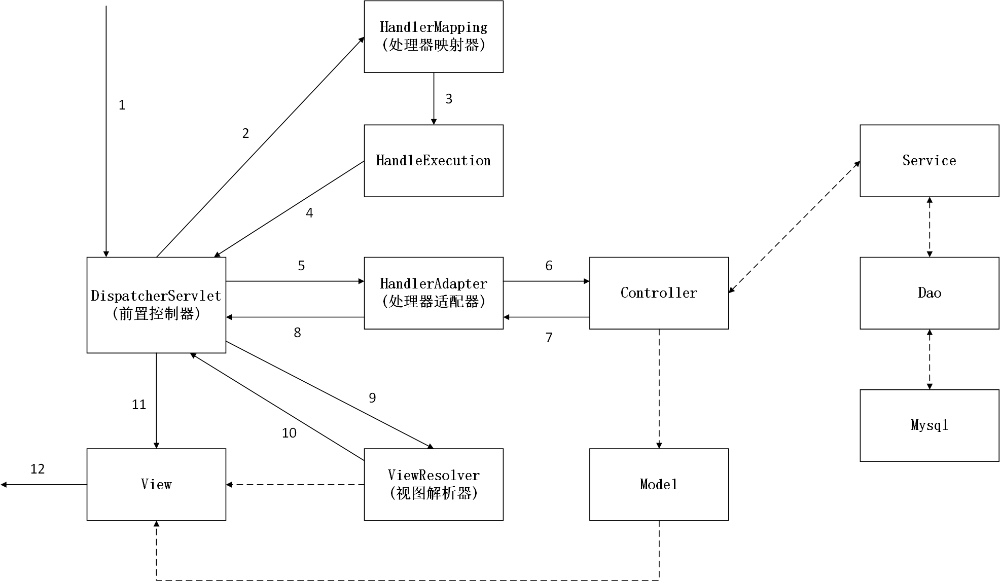

## SpringMVC

### 1. Spring MVC 和 Struts2区别

#### 1.1 共同点

* 都是表现层框架，都是基于MVC模型编写的。
* 它们的底层都离不开ServletAPI。
* 它们处理请求的机制都是一个核心控制器。


#### 1.2 区别

* Spring MVC 的入口是Servlet，而Struts2 是	Filter。
* Spring MVC 是基于方法设计的，而Struts2 是基于类，Struts2每次执行都会创建一个动作类。
* Spring MVC更简洁，处理ajax的请求更方便。


### 2. springmvc入门程序

* 导入相关依赖

```xml

  <dependencies>
    <dependency>
      <groupId>junit</groupId>
      <artifactId>junit</artifactId>
      <version>4.11</version>
      <scope>test</scope>
    </dependency>

    <dependency>
      <groupId>org.springframework</groupId>
      <artifactId>spring-context</artifactId>
      <version>5.0.2.RELEASE</version>
    </dependency>

    <dependency>
      <groupId>org.springframework</groupId>
      <artifactId>spring-web</artifactId>
      <version>5.0.2.RELEASE</version>
    </dependency>

    <dependency>
      <groupId>org.springframework</groupId>
      <artifactId>spring-webmvc</artifactId>
      <version>5.0.2.RELEASE</version>
    </dependency>

    <dependency>
      <groupId>javax.servlet</groupId>
      <artifactId>servlet-api</artifactId>
      <version>2.5</version>
      <scope>provided</scope>
    </dependency>

    <dependency>
      <groupId>javax.servlet.jsp</groupId>
      <artifactId>jsp-api</artifactId>
      <version>2.0</version>
      <scope>provided</scope>
    </dependency>

    <dependency>
      <groupId>javax.servlet</groupId>
      <artifactId>jstl</artifactId>
      <version>1.2</version>
    </dependency>

  </dependencies>
```

* 在web.xml配置前置控制器DispatcherServlet，并设置启动加载springmvc.xml文件

```xml
  <servlet>
    <servlet-name>DispatcherServlet</servlet-name>
    <servlet-class>org.springframework.web.servlet.DispatcherServlet</servlet-class>
      <!--DispatchServlet要绑定Spring的配置文件-->
    <init-param>
      <param-name>contextConfigLocation</param-name>
      <param-value>classpath:springmvc.xml</param-value>
    </init-param>
		<!--启动级别 1 -->
    <load-on-startup>1</load-on-startup>
  </servlet>

	<!--
		/: 只匹配所有请求，不会去匹配jsp界面
		/*:匹配所有请求
	-->
  <servlet-mapping>
    <servlet-name>DispatcherServlet</servlet-name>
    <url-pattern>/</url-pattern>
  </servlet-mapping>
```

* 在springmvc.xml 配置处理器映射器、处理器适配器和视图解析器

```xml
    <!--开启注解扫描-->
    <context:component-scan base-package="com.lyb"></context:component-scan>

    <!--配置视图解析器-->
    <bean id="internalResourceViewResolver" class="org.springframework.web.servlet.view.InternalResourceViewResolver">
        <!--视图解析文件路径-->
        <property name="prefix" value="/WEB-INF/pages/"/>
        <!--文件的后缀名-->
        <property name="suffix" value=".jsp"/>
    </bean>

    <!--开启对springMVC注解的支持1.处理器映射器 2.处理器处理器适配器-->
    <mvc:annotation-driven/>
```

* 在index.jsp中设置一个访问链接

```jsp
<%@ page contentType="text/html;charset=UTF-8" language="java" %>
<html>
<head>
    <title>Title</title>
</head>
<body>
    这是主页
    <br>
    <a href="hello">入口</a>
</body>
</html>
```

* 在controller中设置映射地址，操作完成后返回视图

```java
@Controller
public class HelloController {

    @RequestMapping(path = "/hello")
    public String SayHello(){
        System.out.println("你好，Spring MVC");
        return "success";
    }
}
```

* 设置一个访问成功的success.jsp页面接收controller返回的内容

```jsp
<%@ page contentType="text/html;charset=UTF-8" language="java" %>
<html>
<head>
    <title>成功界面</title>
</head>
<body>
    <h2>成功界面</h2>
</body>
</html>
```


### 3. Spring MVC 执行原理




#### 简要分析执行流程

* DispatcherServlet表示前置控制器，是整个SpringMVC的控制中心。用户发出请求，DispatcherServlet接收请求并拦截请求。

  我们假设请求的url为 :` http://localhost:8080/SpringMVC/hello`

  

  **如上url拆分成三部分：**

  `http://localhost:8080`：服务器域名

  `SpringMVC`：部署在服务器上的web站点

  `hello`：表示控制器

  通过分析，如上url表示为：请求位于**服务器localhost:8080**上的**SpringMVC站点**的**hello控制器**。

* HandlerMapping为处理器映射。DispatcherServlet调用HandlerMapping,HandlerMapping根据请求url查找Handler。

* HandlerExecution表示具体的Handler,其主要作用是根据url查找控制器，如上url被查找控制器为：hello。

* HandlerExecution将解析后的信息传递给DispatcherServlet,如解析控制器映射等。

* HandlerAdapter表示处理器适配器，其按照特定的规则去执行Handler。

* Handler让具体的Controller执行。

* Controller将**具体的执行信息**返回给HandlerAdapter,如ModelAndView。

* HandlerAdapter将**视图逻辑名或模型**传递给DispatcherServlet。

* DispatcherServlet调用视图解析器(ViewResolver)来解析HandlerAdapter传递的**逻辑视图名**。

* 视图解析器将**解析的逻辑视图名**传给DispatcherServlet。

* DispatcherServlet根据**视图解析器解析的视图结果**，调用具体的视图。

* 最终视图呈现给用户。


### 4. springMVC使用步骤

* 新建一个web项目
* 导入相关jar包
* 编写web.xml , 注册DispatcherServlet
* 编写springmvc配置文件
* 接下来就是去创建对应的控制类 , controller
* 最后完善前端视图和controller之间的对应
* 测试运行调试.

使用springMVC必须配置的三大件：

**处理器映射器、处理器适配器、视图解析器**

通常，我们只需要**手动配置视图解析器**，而**处理器映射器**和**处理器适配器**只需要开启**注解驱动**即可，而省去了大段的xml配置


### 5. RequestMapping

- @RequestMapping注解用于映射url到控制器类或一个特定的处理程序方法。可用于类或方法上。用于类上，表示类中的所有响应请求的方法都是以该地址作为父路径。
- 为了测试结论更加准确，我们可以加上一个项目名测试 myweb
- 只注解在方法上面

- ```
  @Controller
  public class TestController {
     @RequestMapping("/h1")
     public String test(){
         return "test";
    }
  }
  ```

  访问路径：`http://localhost:8080 / 项目名 / h1`

- 同时注解类与方法

  ```
  @Controller
  @RequestMapping("/admin")
  public class TestController {
     @RequestMapping("/h1")
     public String test(){
         return "test";
    }
  }
  ```

  访问路径：`http://localhost:8080 / 项目名/ admin /h1 ` , 需要先指定类的路径再指定方法的路径；


### 6. RestFul 风格

* **概念**
  * Restful就是一个资源定位及资源操作的风格。不是标准也不是协议，只是一种风格。基于这个风格设计的软件可以更简洁，更有层次，更易于实现缓存等机制。
* **功能**
  * 资源：互联网所有的事物都可以被抽象为资源
  * 资源操作：使用POST、DELETE、PUT、GET，使用不同方法对资源进行操作。分别对应 添加、 删除、修改、查询。
* 在Spring MVC中可以使用  @PathVariable 注解，让方法参数的值对应绑定到一个URI模板变量上。

```java
@Controller
public class Controller1 {
    @RequestMapping(value = "/add/{a}/{b}")
    public String add(@PathVariable int a,@PathVariable String b, Model model){
        String res = a + b;
        model.addAttribute("msg","结果为"+res);
        return "a";
    }
}

```

* 好处：

  * 使路径变得更加简洁；
  * 获得参数更加方便，框架会自动进行类型转换。
  * 通过路径变量的类型可以约束访问参数，如果类型不一样，则访问不到对应的请求方法，如这里访问是的路径是/commit/1/a，则路径与方法不匹配，而不会是参数转换失败。

* **使用method属性指定请求类型**

  * 用于约束请求的类型，可以收窄请求范围。指定请求谓词的类型如GET, POST, HEAD, OPTIONS, PUT, PATCH, DELETE, TRACE等

  * ```java
    //只有get方法请求，才会出现响应
    @RequestMapping(value = "/add/{a}/{b}",method = RequestMethod.GET)
    ```

  * `@GetMapping` 是一个组合注解，平时使用的会比较多！它所扮演的是 `@RequestMapping(method =RequestMethod.GET)` 的一个快捷方式。

  * ```java
    @GetMapping
    @PostMapping
    @PutMapping
    @DeleteMapping
    @PatchMapping
    ```

  