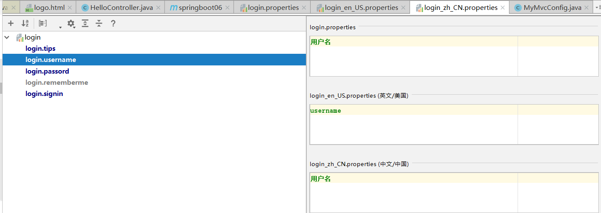

## springboot

### 1. 国际化

* **编写国际化配置文件；**
* 使用ResourceBundleMessageSource管理国际化资源文件
* 在页面使用fmt:message取出国际化内容

#### 1.1 步骤

* 在resources中创建 i18n 文件夹，并添加不同国家的配置文件

```
login.properties 默认的显示文件
login_en_US.properties 语言为英语（美国）的显示文件
login_zh_CN.properties 语言问中文（中国）的显示文件
```

* 打开其中一个文件（login_zh_CN.properties），点击Resources Bundle，进行添加



* 去配置文件进行路径配置

```properties
spring.messages.basename=i18n.login
```

* 在HTML页面进行添加

```html
	<body class="text-center">
		<form class="form-signin" action="dashboard.html">
			
			<h1 class="h3 mb-3 font-weight-normal" th:text="#{login.tips}">Please sign in</h1>
			<label class="sr-only" th:text="#{login.username}">Username</label>
			<input type="text" class="form-control" placeholder="Username" required="" autofocus="">
			<label class="sr-only" th:text="#{login.passord}">Password</label>
			<input type="password" class="form-control" placeholder="Password" required="">
			<div class="checkbox mb-3">
				<label>
          <input type="checkbox" value="remember-me"/> [[#{login.rememberme}]]
        </label>
			</div>
			<button class="btn btn-lg btn-primary btn-block" type="submit" th:text="#{login.signin}">Sign in</button>
			<p class="mt-5 mb-3 text-muted">© 2017-2018</p>
			<a class="btn btn-sm">中文</a>
			<a class="btn btn-sm">English</a>
		</form>
	</body>
```

* **注意：**

  * 国际化由 MessageSourceAutoConfiguration 进行自动自动配置，由源码可以看出前缀为`spring.messages`

  ```java
  @Configuration(proxyBeanMethods = false)
  @ConditionalOnMissingBean(name = AbstractApplicationContext.MESSAGE_SOURCE_BEAN_NAME, search = SearchStrategy.CURRENT)
  @AutoConfigureOrder(Ordered.HIGHEST_PRECEDENCE)
  @Conditional(ResourceBundleCondition.class)
  @EnableConfigurationProperties
  public class MessageSourceAutoConfiguration {
  
  	private static final Resource[] NO_RESOURCES = {};
  	@Bean
  	@ConfigurationProperties(prefix = "spring.messages")
  	public MessageSourceProperties messageSourceProperties() {
  		return new MessageSourceProperties();
  	}
  
  ```

  ```java
  protected static class ResourceBundleCondition extends SpringBootCondition {
  
  		private static ConcurrentReferenceHashMap<String, ConditionOutcome> cache = new ConcurrentReferenceHashMap<>();
  
  		@Override
  		public ConditionOutcome getMatchOutcome(ConditionContext context, AnnotatedTypeMetadata metadata) {
  			String basename = context.getEnvironment().getProperty("spring.messages.basename", "messages");
  			ConditionOutcome outcome = cache.get(basename);
  			if (outcome == null) {
  				outcome = getMatchOutcomeForBasename(context, basename);
  				cache.put(basename, outcome);
  			}
  			return outcome;
  		}
  
  		private ConditionOutcome getMatchOutcomeForBasename(ConditionContext context, String basename) {
  			ConditionMessage.Builder message = ConditionMessage.forCondition("ResourceBundle");
  			for (String name : StringUtils.commaDelimitedListToStringArray(StringUtils.trimAllWhitespace(basename))) {
  				for (Resource resource : getResources(context.getClassLoader(), name)) {
  					if (resource.exists()) {
  						return ConditionOutcome.match(message.found("bundle").items(resource));
  					}
  				}
  			}
  			return ConditionOutcome.noMatch(message.didNotFind("bundle with basename " + basename).atAll());
  		}
  
  		private Resource[] getResources(ClassLoader classLoader, String name) {
  			String target = name.replace('.', '/');
  			try {
  				return new PathMatchingResourcePatternResolver(classLoader)
  						.getResources("classpath*:" + target + ".properties");
  			}
  			catch (Exception ex) {
  				return NO_RESOURCES;
  			}
  		}
  
  	}
  ```

  * 显示乱码问题：
    * 在setting中，找到 file Encodings，设置好 properties 的编码即可


#### 1.2 点击切换语言

* 设置链接

```html
    <a class="btn btn-sm" th:href="@{/index.html(l='zh_CN')}">中文</a>
    <a class="btn btn-sm" th:href="@{/index.html(l='en_US')}">English</a>
```

* 编写 LocaleResolver

```java
public class MyLocaleResolver implements LocaleResolver {
    @Override
    public Locale resolveLocale(HttpServletRequest httpServletRequest) {
        //获取参数
        String l = httpServletRequest.getParameter("l");
        //创建 locale 并设置默认值（默认值为浏览器设置）
        Locale locale = Locale.getDefault();
        //判断 参数 l 的值是否为空
        if(!StringUtils.isEmpty(l)){
            //zh_CN 需要分割放到 locale 中
            String[] split = l.split("_");
            locale = new Locale(split[0],split[1]);
        }
        return locale;
    }
    @Override
    public void setLocale(HttpServletRequest httpServletRequest, HttpServletResponse httpServletResponse, Locale locale) {

    }
}

```

* 添加到容器中

```java
@Configuration
public class MyMvcConfig implements WebMvcConfigurer {
    @Override
    public void addViewControllers(ViewControllerRegistry registry) {
        registry.addViewController("/").setViewName("logo");
        registry.addViewController("/index").setViewName("logo");
        registry.addViewController("/index.html").setViewName("logo");
    }

    //添加到 MyMvcConfig 中方便管理
    @Bean
    public LocaleResolver localeResolver(){
        return new MyLocaleResolver();
    }
}

```


### 2. 登录

开发期间模板引擎页面修改以后，要实时生效

* 禁用模板引擎的缓存

```
# 禁用缓存
spring.thymeleaf.cache=false 
```

* 页面修改完成以后ctrl+f9：重新编译；


#### 登录表单

```html
		<form class="form-signin" action="dashboard.html" th:action="@{/user/login}" method="post">
			
			<!---->
			<h1 class="h3 mb-3 font-weight-normal" th:text="#{login.tips}">Please sign in</h1>
			<p th:text="${msg}" style="color: red;" th:if="${not #strings.isEmpty(msg)}"></p>
			<label class="sr-only" th:text="#{login.username}">Username</label>
			<input type="text" name="username" class="form-control" placeholder="Username" th:placeholder="#{login.username}" required="" autofocus="">
			<label class="sr-only" th:text="#{login.passord}">Password</label>
			<input type="password" name="password" class="form-control" placeholder="Password" th:placeholder="#{login.passord}" required="">
			<div class="checkbox mb-3">
				<label>
          <input type="checkbox" value="remember-me"/> [[#{login.rememberme}]]
        </label>
			</div>
			<button class="btn btn-lg btn-primary btn-block" type="submit" th:text="#{login.signin}">Sign in</button>
			<p class="mt-5 mb-3 text-muted">© 2017-2018</p>
			<a class="btn btn-sm" th:href="@{/index.html(l='zh_CN')}">中文</a>
			<a class="btn btn-sm" th:href="@{/index.html(l='en_US')}">English</a>
		</form>
```

#### Controller层

```java
    @PostMapping("/user/login")
    public String login(@RequestParam("username") String username, @RequestParam("password") String password, Model model, HttpSession session) {
        System.out.println("login->");
        if ((!StringUtils.isEmpty(username)) && "123456".equals(password)) {
            session.setAttribute("loginUser",username);
            System.out.println("成功");
            return "redirect:/main.html";
        }else {
            model.addAttribute("msg","用户名密码错误");
            System.out.println("错误");
            return "login";
        }

    }
```

#### 拦截器

* 若用户没有登录状态，则自动跳转到登录页面

```java
public class LoginHandlerInterceptor implements HandlerInterceptor {
    //执行前
    @Override
    public boolean preHandle(HttpServletRequest request, HttpServletResponse response, Object handler) throws Exception {
        Object user = request.getSession().getAttribute("loginUser");
        if (user == null){
            request.setAttribute("msg","还未登录!");
            request.getRequestDispatcher("/index.html").forward(request,response);
            return false;
        }else {
            return true;
        }
    }

    //执行后
    @Override
    public void postHandle(HttpServletRequest request, HttpServletResponse response, Object handler, ModelAndView modelAndView) throws Exception {

    }
    //清理
    @Override
    public void afterCompletion(HttpServletRequest request, HttpServletResponse response, Object handler, Exception ex) throws Exception {

    }
}

```

* 去配置加载到容器中

```java
@Configuration
public class MyMvcConfig implements WebMvcConfigurer {

    @Override
    public void addViewControllers(ViewControllerRegistry registry) {
        registry.addViewController("/").setViewName("login");
        registry.addViewController("/index").setViewName("login");
        registry.addViewController("/index.html").setViewName("login");
        registry.addViewController("/main.html").setViewName("dashboard");

    }

    //拦截未登录状态
    @Override
    public void addInterceptors(InterceptorRegistry registry) {
        registry.addInterceptor(new LoginHandlerInterceptor()).addPathPatterns("/**")
                .excludePathPatterns("/asserts/**","/webjars/**","/index.html","/","/index","/user/login");//注意 / 和 对静态资源的拦截排除
    }

    @Bean
    public LocaleResolver localeResolver(){
        return new MyLocaleResolver();
    }
}

```


### 4. CRUD

实验要求：

1）、RestfulCRUD：CRUD满足Rest风格；

URI：  /资源名称/资源标识       HTTP请求方式区分对资源CRUD操作

|      | 普通CRUD（uri来区分操作） | RestfulCRUD       |
| ---- | ------------------------- | ----------------- |
| 查询 | getEmp                    | emp---GET         |
| 添加 | addEmp?xxx                | emp---POST        |
| 修改 | updateEmp?id=xxx&xxx=xx   | emp/{id}---PUT    |
| 删除 | deleteEmp?id=1            | emp/{id}---DELETE |

2）、实验的请求架构;

| 实验功能                             | 请求URI | 请求方式 |
| ------------------------------------ | ------- | -------- |
| 查询所有员工                         | emps    | GET      |
| 查询某个员工(来到修改页面)           | emp/1   | GET      |
| 来到添加页面                         | emp     | GET      |
| 添加员工                             | emp     | POST     |
| 来到修改页面（查出员工进行信息回显） | emp/1   | GET      |
| 修改员工                             | emp     | PUT      |
| 删除员工                             | emp/1   | DELETE   |


#### 4.1 thymeleaf公共页面元素抽取

```html
1、抽取公共片段
<div th:fragment="copy">
&copy; 2011 The Good Thymes Virtual Grocery
</div>

2、引入公共片段
<div th:insert="~{footer :: copy}"></div>
~{templatename::selector}：模板名::选择器
~{templatename::fragmentname}:模板名::片段名

3、默认效果：
insert的公共片段在div标签中
如果使用th:insert等属性进行引入，可以不用写~{}：
行内写法可以加上：[[~{}]];[(~{})]；
```


三种引入公共片段的th属性：

**th:insert**：将公共片段整个插入到声明引入的元素中

**th:replace**：将声明引入的元素替换为公共片段

**th:include**：将被引入的片段的内容包含进这个标签中


```html
<footer th:fragment="copy">
&copy; 2011 The Good Thymes Virtual Grocery
</footer>

引入方式
<div th:insert="footer :: copy"></div>
<div th:replace="footer :: copy"></div>
<div th:include="footer :: copy"></div>

效果
<div>
    <footer>
    &copy; 2011 The Good Thymes Virtual Grocery
    </footer>
</div>

<footer>
&copy; 2011 The Good Thymes Virtual Grocery
</footer>

<div>
&copy; 2011 The Good Thymes Virtual Grocery
</div>
```


**点击按钮高亮**

* list 侧边栏传入参数

```html
    <div th:replace="common/bar::#sidebar(activeUri='emps')"></div>
```

* dashboard 侧边栏传入参数

```html
    <div th:replace="common/bar::#sidebar(activeUri='main.html')"></div>
```

* 公共部分进行判断

```html
	<a class="nav-link active" href="#" th:href="@{/main.html}" th:class="${activeUri=='main.html'? 'nav-link active':'nav-link'}">

	<a class="nav-link" th:href="@{/emps}" href="#" th:class="${activeUri=='emps'?'nav-link active':'nav-link'}">
```


#### 4.2 员工查询

```html
<h2><button class="btn btn-sm btn-success">员工添加</button></h2>
<div class="table-responsive">
    <table class="table table-striped table-sm">
        <thead>
            <tr>
                <th>#</th>
                <th>lastName</th>
                <th>email</th>
                <th>gender</th>
                <th>department</th>
                <th>birth</th>
                <th>操作</th>
            </tr>
        </thead>
        <tbody>
            <tr th:each="emp:${emps}">
                <td th:text="${emp.id}"></td>
                <td th:text="${emp.lastName}"></td>
                <td th:text="${emp.email}"></td>
                <td th:text="${emp.gender}==0?'女':'男'"></td>
                <td>[[${emp.department.departmentName}]]</td>
                <td th:text="${#dates.format(emp.birth,'yyyy-MM-dd HH:mm')}"></td>
                <td>
                    <button class="btn btn-sm btn-primary">编辑</button>
                    <button class="btn btn-sm btn-danger">删除</button>
                </td>
            </tr>
        </tbody>
    </table>
```

* Controller

```java
@Controller
public class EmployeeController {

    @Autowired
    EmployeeDao employeeDao;

    @GetMapping("/emps")
    public String list(Model model){
        //查询
        Collection<Employee> list = employeeDao.getAll();
        //放到请求域中
        model.addAttribute("emps",list);

        return "emp/list";
    }
}
```


