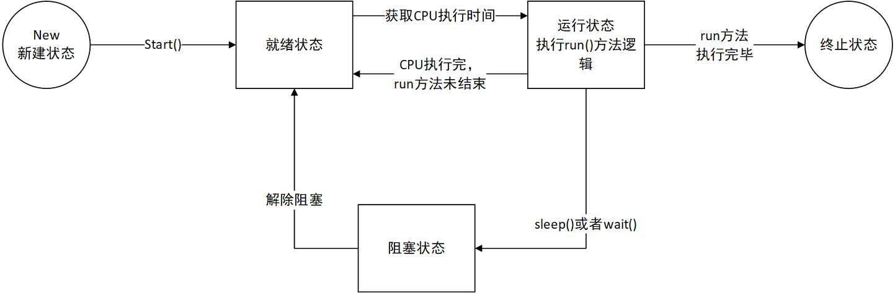

## 21~40

### 21. 为什么框架的异常都是继承RunTimeException

框架定义了一系列的规则，出现的异常属于逻辑错误。

#### throw和throws的区别

throw：作用于方法内，用于主动抛出异常

throws：作用于方法声明上，声明该方法有可能会抛出某些异常


### 22. 创建线程的方式

创建线程的方式有以下三种：

* 继承Thread
* 实现Runnable接口
* 实现Callable接口（可以获取线程执行之后的返回值）

注：

* 实际后两种，更准确的理解是创建了一个可执行的任务，要采用多线程的方式执行，还需要通过创建Thread对象来执行
* 实际开发中通常采用线程池的方式来完成Thread的创建，更好的管理线程资源

```java

public static void main(String[] args) {
    //方式1
    MyThread mt1 = new MyThread();
    mt1.start();
    //方式2
    MyRunnable r1 = new MyRunnable();
    Thread t1 = new Thread(r1);
    t1.start();
    //方式3
    MyCallable mc1 = new MyCallable();
    FutureTask futureTask = new FutureTask(mc1);
    Thread t2 = new Thread(futureTask);
    t2.start();
    try {
        //获取返回值
        Object o = futureTask.get();
        System.out.println(o);
    } catch (Exception e) {
        e.printStackTrace();
    }
}

class MyThread extends Thread{
    @Override
    public void run() {
        System.out.println(Thread.currentThread().getName()+": running...");
    }
}

class MyRunnable implements Runnable{
    @Override
    public void run() {
        System.out.println(Thread.currentThread().getName()+": running...");
    }
}

class MyCallable implements Callable<Boolean>{

    @Override
    public Boolean call() throws Exception {
        System.out.println(Thread.currentThread().getName()+": running...");
        return true;
    }
}
```


### 23. Main方法中的GC线程

GC垃圾回收线程：后台线程


### 24. 线程的生命周期



线程共有6种状态：

* new
* runnable
* blocked
* waiting
* timed waiting
* terminated

详细描述：

1. 当进入synchronized同步代码块或者同步方法时，且没有获取到锁，线程就进入了blocked状态，直到锁被释放，重新进入runnable状态
2. 当线程调用wait()或者join时，线程都会进入到waiting状态，当调用notify或者notifyAll时，或者join的线程执行结束后，会进入runnable状态
3. 当线程调用sleep(time)，或者wait(time)时，进入timed waiting状态；当休眠时间结束后，或者调用notify、notifyAll时，会重新进入runnable状态
4. 程序执行结束，线程进入terminated状态

注意：

* blocked、waiting、timed waiting都称为阻塞状态
* 就绪状态和运行状态，都表现为runnable状态


### 25. 线程安全

描述：**当多个线程访问同一个对象时，如果不用进行额外的同步控制或者其他的协调操作，调用这个对象的行为都可以获得正确的结果，可以说这个对象是线程安全的**

如何作做到程安全：

* 同步代码块

  * ```java
    synchronized(同步监视器){
    	//需要同步的代码
    }
    ```

    **说明：**

    1. 操作**共享数据的代码** ，即为需要被同步的代码  --> 不能包含代码多了，也不能包含少了
    2. **共享数据：** 多个线程共同操作的变量，比如：ticket就是共享数据
    3. **同步监视器**。 俗称：锁。任何一个类的对象，都可以充当锁

    *  **要求** ：多个线程必须公用一把锁
    *  **补充：** 在实现Runnable接口创建多线程的方式中，我们可以考虑使用 **this** 充当同步监视器

* 同步方法

  * 同步方法仍然设计到同步监视器，只是不需要我们显式的声明
  * **非静态** 的同步方法，同步监视器为：this
    **静态** 的同步方法，同步监视器为：当前类本身

* Lock锁

  * 使用方法:
    1. 实例化ReentrantLock
    2. 调用锁定方法lock()
    3. 调用解锁方法unlock()


#### synchronized与lock的异同？

* **相同点：** 二者都可以解决线程安全问题
* **不同点：** 
  * synchronized可以给方法和代码块加锁。synchronized机制在执行完相应的同步代码以后，自动释放同步监视器--->目前来说用的多
  * lock只能给代码块加锁。lock需要手动的启动同步（lock()），同时结束同步也需要手动实现（unlock()）---->建议使用
* **优先使用顺序：Lock** --> **同步代码块** （已经进入了方法体，分配了相应资源）->**同步方法** （在方法体之外）


### sleep和wait的区别

1.所属的类不同

* sleep方法是定义在Thread上
* wait方法定义在Object上

2.对于锁资源的处理方式不同

* sleep不会释放锁
* wait会释放锁

3.使用范围

* sleep可以使用在任何代码块
* wait必须使用在同步方法或同步代码块中执行

4.与wait配套使用的方法

* void notify()：唤醒在此对象监视器上等待的单个线程（随机唤醒一个等待中线程）
* void notifyAll()：唤醒在此对象监视器上等待的所有线程
* void wait()：导致当前线程等待，直到其他线程调用此对象的notify()方法或者notifyAll()方法

##### 思考：为什么wait要定义在Object上，而不是定义在Thread中？

在同步代码块中，我们需要一个对象锁来实现多线程的互斥效果，也就是说，java的锁是对象级别的，而不是线程级别的。

##### 思考：为什么wait必须写在同步代码块中？

为了避免CPU切换到其他线程，而其他线程又提前执行了notify方法，那这样就达不到我们预期的（先wait再由其他线程来唤醒），所以需要一个同步锁来保护。


### 26. ThreadLocal的理解

作用：

* 实现了在线程上下文传递对象
* 为每一个线程创建一个副本

```java
public class T1031_2 {

    private static ThreadLocal<Long> threadLocal = new ThreadLocal<>();

    public static void main(String[] args) throws InterruptedException {
        //开启多个线程来执行任务
        Task task = new Task();
        new Thread(task).start();
        Thread.sleep(100);
        new Thread(task).start();
    }

    static class Task implements Runnable{

        @Override
        public void run() {
            Long result = threadLocal.get();
            if (result == null){
                threadLocal.set(System.currentTimeMillis());
                System.out.println(Thread.currentThread().getName()+" : "+threadLocal.get());
            }
        }
    }
}
结果：
Thread-0 : 1604162542755
Thread-1 : 1604162542854
```

原因：

```java
Long result = threadLocal.get();

public T get() {
    //1 获取当前线程
    Thread t = Thread.currentThread();
    //2 获取当前线程对应的map
    ThreadLocalMap map = getMap(t);
    if (map != null) {
        //this为threadlocal，以ThreadLocal为key，获取对应的entry
        ThreadLocalMap.Entry e = map.getEntry(this);
        if (e != null) {
            @SuppressWarnings("unchecked")
            // 获取对应的entry的value。
            T result = (T)e.value;
            return result;
        }
    }
    return setInitialValue();
}

threadLocal.set(System.currentTimeMillis());

public void set(T value) {
    //1 获取当前线程
    Thread t = Thread.currentThread();
    //2. 获取当前线程对应的map
    ThreadLocalMap map = getMap(t);
    if (map != null)
        /*
        	往map中存放一个键值对
        	this：ThreadLocal
        	value：保存的副本
        */
        map.set(this, value);
    else
        createMap(t, value);
}

```

结论：每个线程都有对应的map，map来保存键值对。


##### Threadlocal在实际开发中解决什么问题？

hibernate管理session，mybatis管理sqlsession、管理connection。


### 27. 类的加载机制

#### JVM使用Java类的流程如下：

* Java源文件-->编译-->class文件
* 类加载器ClassLoader会读取.class文件，并将其转换为java.lang.Class的实例。有了这个实例，JVM就可以使用它来创建对象，调用方法等

#### Class文件的来源：

* java内部自带的核心类，位于$JAVA_HOME/jre/lib，其中最著名的莫过于rt.jar
* java的扩展类，位于$JAVA_HOME/jre/ext目录下
* 我们自己开发的类或者项目用到的第三方jar包，位于我们项目的目录下，如：WEB-INF/lib

#### 针对这些Class，JDK怎么分工，怎么加载？

* Java核心类：这些Java运行的基础类，由一个名为BootstrapClassLoader加载器负责加载，这个类加载器被称为"根加载器或者引导加载器"。注意：BootstrapClassLoader不继承ClassLoader，是由JVM内部实现，无法通过java程序访问。
* java拓展类：由ExtClassLoader负责加载，被称为"拓展类加载器"
* 项目编写的类：是由AppClassLoader来负责加载，被称为"系统类加载器"

#### 双亲委托机制

* 含义：所谓的双亲委托机制，就是一个类，会先获得到一个系统类加载器AppClassLoader的实例，然后往上层层请求，先由BootstrapClassLoader去加载。
* 如果BootstrapClassLoader发现没有，再下发给ExtClassLoader去加载，还是没有，才通过AppClassLoader去加载。若都没有，则报错。


### 27. Ajax工作原理

* 异步交互
* XMLHttpRequest对象

* 回调函数：完成局部刷新

场景：注册判断用户名是否唯一....


### 28. JSP和Servlet的区别

技术角度：

* jsp本质就是Servlet
* jsp的工作原理：jsp --> 翻译 --> Servlet（java）--> 编译 --> Class

应用角度：

jsp = HTML+Java

Servlet = Java+HTML

JSP特点在于实现视图，Servlet特点在于实现控制逻辑。


### 29. Servlet的生命周期

Servlet是单实例的。

##### 生命周期流程：

创建对象 --> 初始化 --> service() --> doXXX() --> 销毁

##### 创建对象的时机：

* 默认是第一次访问改Servlet的时候创建
* 也可以通过配置web.xml来改变创建时机，比如在容器启动的时候去创建。像：DispatcherServlet（SpringMVC前端控制器）`<load-on-startup>1</load-on-startup>`

##### 执行次数：

* 对象的创建只有一次

* 初始化一次

* 销毁一次


### 30. Cookie和Session的区别

##### 储存位置：

Session：服务器

Cookie：客户端

##### 存储的数据格式：

Session：value为对象，Object类型（对象需要序列化）

Cookie：value为字符串，如果我们存储一个对象，需要转换为JSON

##### 存储的数据大小：

Session：受服务器内存控制

Cookie：一般来说，最大4K

##### 生命周期：

Session：服务器控制，默认30分钟。当用户关闭浏览器，Session也不会消失

Cookie：客户端控制，分成两种情况：

* 默认的是会话级的cookie，这种随着浏览器的关闭而消失，比如保存sessionId的cookie
* 非会话级cookie，通过设置有效期来控制，如"免登录"功能。需要设置有效期setMaxAge


cookie的其他设置：

* httpOnly=true：防止客户端XSS攻击（XSS攻击：跨站脚本攻击）
* path="/"：访问路径
* domain=""：设置cookie的域名


### 31. 转发和重定向的区别

**转发：**发生在服务器内部的跳转，所以对于客户端来说，自始至终都是就是一次请求，这期间保存在request对象中的数据可以传递

**重定向：**在客户端的跳转，是多次请求，这个时候如果需要在多次请求之间传递数据，就需要用session对象。

**问：**在后台查询，想要跳转到百度，用重定向还是请求转发？

**答：**重定向。因为请求转发的范围限制在服务器内部。


### 32. 谈谈分层架构和MVC

##### 分层架构：

* web层：负责与用户交互并对外提供服务接口
* 业务逻辑层：实现业务逻辑模块
* 数据存取层：将业务逻辑层处理的结果持久化，方便后续查询

##### 每层各自的框架：

web层：SpringMVC、Struts2，Struts1..

业务逻辑层：spring

数据持久层：Hibernate、Mybatis、SpringDataJPA、SpringJDBC ..

#### MVC是对web层做了进一步的划分，更加细化

* model：模型。代表一个存储数据的对象或者JAVA POJO
* view：视图。代表模型包含的数据的可视化。比如HTML，jsp，thymeleaf等
* controller：控制器。控制器作用于模型和视图上，它控制数据流向模型对象，并在数据变化时更新视图，它使视图与模型分离开，目前的技术代表为Servlet、Controller


### 33. jsp的9大内置对象

无需自己创建，可以直接使用

| 内置对象名  |        类型         |
| :---------: | :-----------------: |
|   request   | HttpServletRequest  |
|  response   | HttpServletResponse |
|   config    |    ServletConfig    |
| application |   ServletContext    |
|   session   |     HttpSession     |
|  exception  |      Throwable      |
|    page     |   Object（this）    |
|     out     |      JspWriter      |
| pageContext |     PageContext     |


### 34. JSP四大域对象

* ServletContext context域：只能在同一个web应用中使用（全局的）
* HTTPSession session域：只能在同一个会话（session对象）中使用
* HttpServletRequest request域：只能在同一个请求中使用（转发有效，重定向无效）
* PageContext page：只能在当前jsp页面使用（当前页）


### 35. 并发和并行的区别

并发：**同一个CPU**执行多个任务，按细分的时间片交替执行

并行：在**多个CPU**上同时处理多个任务


### 36. 数据库设计的三大范式以及反范式

第一范式：列不可分。例如收获地址：XX省XX市要分成两个列，省和市，而不是一个。

第二范式：要有主键

第三范式：不存在可传递依赖。例如两张表进行关联，只需要一个关联的字段即可，其他可以通过关联查询获得。避免产生冗余信息，浪费磁盘空间。

##### 反范式设计：（第三范式）

* 原因一：提高查询效率（读多写少）。如查询商品信息时，可以多添加一个商品名称，让联表查询转换为单表查询。
* 原因二：保存历史快照信息。例如：订单表，里面还需要包含收货人的各项信息。属于历史快照，需要冗余保存起来


### 37. 聚合函数

* COUNT(*|列)：求出全部的记录数
* SUM(列)：求出总和
* AVG(列)：平均值
* MAX(列)：最大值
* MIN(列)：最小值

使用示例：

```sql
select count(*) from student;
```


### 38. 表连接查询


* mysql 没有全外连接


### 39. 如何解决SQL注入

采用预处理对象，采用PreparedStatement对象，而不是Statement对象。另外还可以提高执行效率，因为是预编译执行。

##### Mybatis如何解决SQL注入的问题？

采用#，#可以解决SQL注入，而$号不行。


### 40. 事务的特性

##### 原子性（Atomicity）是基础，隔离性（Consistency）是手段，一致性（Isolation）是约束条件，持久性（Durability）是我们的目的。简称：ACID

**原子性：**事务是数据库的逻辑工作单位，事务中包含的各种操作要么都完成，要么都不完成。

**一致性：**数据库中的数据在事务操作前后都必须满足业务规则约束。例如：A给B转账，转账前后，AB的账户总金额应该是一致的。

**隔离性：**一个事务不能被其他事务干扰。

**持久性：**事务一旦提交，结果便是永久性的。