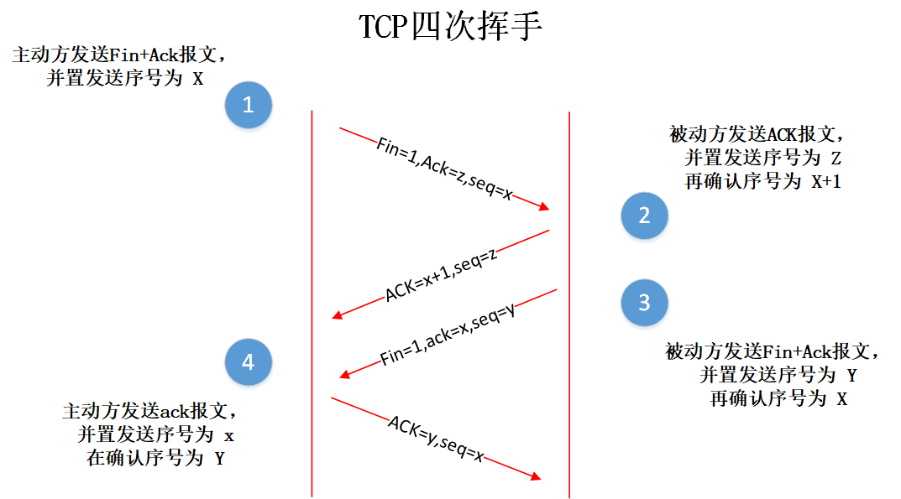

## 41~60

### 41. 事务的隔离级别

##### 数据库的并发问题

- 对于同时运行的多个事务, 当这些事务访问数据库中相同的数据时, 如果没有采取必要的隔离机制, 就会导致各种并发问题:
  - **脏读**: 对于两个事务 T1, T2, T1 读取了已经被 T2 更新但还**没有被提交**的字段。之后, 若 T2 回滚, T1读取的内容就是临时且无效的。
  - **不可重复读**: 对于两个事务T1, T2, T1 读取了一个字段, 然后 T2 **更新**了该字段。之后, T1再次读取同一个字段, 值就不同了。
  - **幻读**: 对于两个事务T1, T2, T1 从一个表中读取了一个字段, 然后 T2 在该表中**插入**了一些新的行。之后, 如果 T1 再次读取同一个表, 就会多出几行。
- **数据库事务的隔离性**: 数据库系统必须具有隔离并发运行各个事务的能力, 使它们不会相互影响, 避免各种并发问题。
- 一个事务与其他事务隔离的程度称为隔离级别。数据库规定了多种事务隔离级别, 不同隔离级别对应不同的干扰程度, **隔离级别越高, 数据一致性就越好, 但并发性越弱。**

#####  数据库的隔离级别

- 数据库提供的4种事务隔离级别：

  

- READ COMMITED：解决了**脏读**问题
- READ COMMITED：解决了**脏读、不可重复读**问题
- Mysql 支持 4 种事务隔离级别。Mysql 默认的事务隔离级别为: **REPEATABLE READ。**

### 42. TCP和UDP的区别

相同：两者都是传输层的协议

不同：

* TCP提供可靠的传输协议，传输前需要建立连接，面向字节流，传输慢
* UDP无法保证传输的可靠性，无需创建连接，以报文的方式传输，效率高

##### TCP的三次握手：

**TCP四次挥手：**

### 43. 死锁的产生和避免

##### 什么是死锁？

线程A持有独占资源a，并尝试去获取独占资源b；线程B持有独占资源b，并尝试去获取独占资源a；这样线程A和线程B相互持有对方需要的锁，从而发生阻塞，变成死锁。

##### 如何防止死锁？

* 尽量采用tryLock（timeout）的方法，可以设置超时时间，这样超时之后，就可以主动退出，防止死锁。
* 减少同步代码块嵌套操作
* 降低锁的使用粒度，不要几个功能共用一把锁。