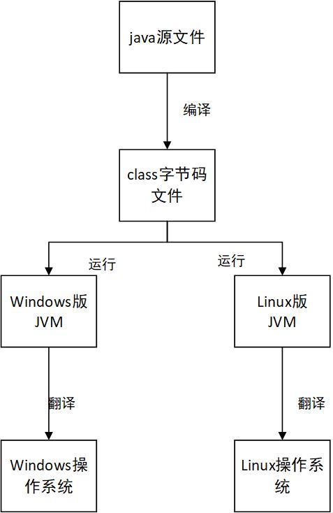
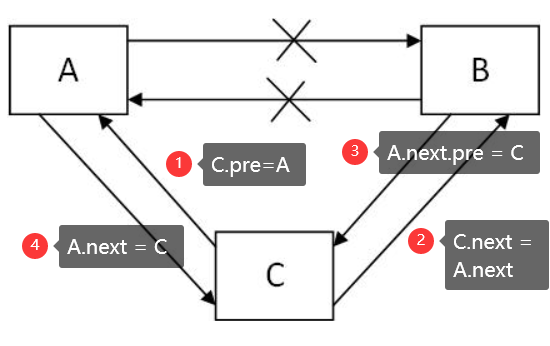

## 1~10

### 1. 面向对象和面向过程的区别

面向过程相当于一个“执行者”；面向对象相当于一个“组织者”。


### 2. JDK、JRE、JVM有什么区别

**JDK：**java开发工具包，提供了java的开发环境和运行环境

**JRE：**java运行环境，包含了java虚拟机及一些基础类库

**JVM：**java虚拟机，提供了执行字节码文件的能力

**JDK 包含了 JRE，JRE 包含了 JVM**




### 3. ==和equals的区别

**==：**比较的是值；

* 比较**基本的数据类型**：比较的是数值
* 比较**引用类型**：比较引用指向的值

**equals：**默认比较的是地址，因为这个方法的最初定义在Object上，默认的实现就是比较地址

* 自定义类：如果需要比较的是内容，需要和String一样，重写equals方法。
* Object类中equals()的定义：Object类中定义的equals()和==的作用是相同的：比较两个对象的地址值是否相同，即两个引用是否指向同一个对象实体
* 像String、Date、File、包装类等都重写了Object类中的equals()方法。重写以后，比较的不是两个引用地址是否相同，而是比较两个对象的“实体内容”是否相同

```java
        String s1 = new String("ab");
        String s2 = new String("ab");
        System.out.println(s1 == s2);//false，new创建了新对象，地址值不一致
        String s3 = "ab";
        String s4 = "ab";
        System.out.println(s3 == s4);//true，都指向常量池，地址值一致
        System.out.println(s1 == s3);//false
        String s5 = "abab";
        String s6 = s3+s4;
        System.out.println(s5 == s6);//false，String不可变，相当于new
        final String s7 = "ab";
        final String s8 = "ab";
        String s9 = s7 + s8;
        System.out.println(s5 == s9);//true; final 定义为常量，所以都是常量
        final String s10 = s3 + s4;
        System.out.println(s5 == s10);//false; 虽然s10定义final，但是s3,s4会改变
```


### 4. final

* final修饰类：该类不可变，不可继承；例如String，不可变性
* final修饰方法：该方法不可重写；比如模板方法，可以固定我们的算法
* 修饰变量：变量就是常量

注意：

> 修饰的是基本数据类型，这个值本身不能修改
>
> **修饰的是引用类型，引用的指向不能修改**

```java
	final Student student = new Student("1","Bob");
	student.setAge(18);//这样是可以的
```


### 5. String、StringBuffer、StringBuilder区别

String和其他两个的区别是

* String是final类型，每次声明都是不可变对象
* 每次操作都会产生新的String对象，然后将指针指向新的String对象

StringBuffer、StringBulider都是在原有对象上进行操作，所以需要经常改变字符串内容，建议使用这两个

StringBuilder线程不安全，性能更高，StringBuffer线程安全，优先采用StringBuilder；

StringBuilder > StringBuffer > String


### 6. 接口和抽象类的区别

JDK1.8之前：

* 语法：
  * 抽象类：方法可以有抽象的，也可以有非抽象的，还有构造器
  * 接口：方法都是抽象的，属性都是常量，默认有public static final修饰
* 设计：
  * 抽象类：同一类事物的抽取，比如针对Dao层操作的封装；如：BaseDao，BaseServiceImpl
  * 接口：通常更像是一种标准的制定，定制系统之间对接的标准。如
    * 单体项目：分层开发，interface作为各层之间的纽带，在controller中注入UserService，在Service中注入UserDao
    * 分布式项目：面向服务的开发，抽取服务service，这时候就会产生服务的提供者和服务的消费者两个角色。这两个角色之间的纽带，也是接口

JDK1.8之后：

* 接口里面可以有实现的方法，注意：在方法的声明上加上default或者static。（一般都是空实现）


### 7. 递归必备掌握题目

* N的阶乘

```java
    public int nindex(int n){
        if(n < 0){
            return -1;
        }else if(n == 1 || n == 0){
            return 1;
        }else{
            return n * nindex(n - 1);
        }
    }
```

* 斐波那契数列

```java
    public int setResult(int n) {
        if(n < 0){
            return -1;
        }else if (n == 0) {
            return 0;
        } else if (n == 1) {
            return 1;
        } else {
            return setResult(n - 1) + setResult(n - 2);
        }
    }
```

问：递归太多层，或者没有出现正确结束递归，则会出现“栈内存溢出的异常”，问为什么出现的是栈内存溢出，而不是堆内存溢出？

答：每次调用方法，是在栈里面创建一个栈帧的空间。


### 8. Integer&int（缓存&自动装箱和拆箱）

```java
        Integer i1 = new Integer(12);
        Integer i2 = new Integer(12);
        System.out.println(i1 == i2);//false new是在堆内存开辟一块空间，在栈中的i1和i2指向堆空间

        Integer i3 = 12;//自动装箱 Integer.value(12);
        Integer i4 = 12;
        int i5 = 12;
        System.out.println(i3 == i4);//true
        System.out.println(i3 == i5);//true 自动拆箱，比较数值

        Integer i6 = 128;
        Integer i7 = 128;
        int i8 = 128;
        System.out.println(i6 == i7);//false 在-128~127之间，使用的是Integer里面的缓存，否则new 
        System.out.println(i6 == i8);//true 自动拆箱，比较数值
```


### 9. 方法的重写和重载的区别

重载：发生在一个类里面，方法名相同，参数列表不同（与返回类型无关）

* 注意：下面这个不构成重载

```java
	public double add(int a,int b)
    public int add(int a,int b)
```

重写：发生在父类子类之间，方法名相同，参数列表相同；


### 10. List&Set(Collections&Collection)

* List：有序，可重复 --> ArrayList、LinkedList
* Set：无序，不重复 --> HashSet、TreeSet
* Collections：工具类；工具类命名：+s结尾
* Collection：最顶层的集合的接口。

***

## 11~20

### 11. ArrayList和LinkedList的区别

#### 1. 底层数据结构的差异

* ArrayList：数组，连续一块内存空间
* LinkedList：双向列表，不是连续的内存空间


#### 2.常规结论

* ArrayList：查找快，因为是连续的内存空间，方便寻址；删除，插入慢，因为要发生数据的迁移
* LinkedList：查找慢，因为要通过指针一个个去寻找；但是删除，插入块，只需要改变前后节点的指针指向即可。


**问：**确定要存储1000个对象的信息，ArrayList和LinkedList谁更省内存？

**答：**ArrayList。需要初始化空间，确定为1000，不需要后期的扩容。因为ArrayList是连续的内存空间，只需要存储data即可；LinkedList是双向链表，不仅仅需要存储data，还需要存储指向前一个节点的指针和指向后一个节点的指针。


#### 3. ArrayList细节

特点：

* 底层数组：连续的内存空间
* 长度固定

扩容：

* 创建一个新数组；新数组长度是原数组长度的1.5倍（位运算；new = old + (old >> 1)）
* 将原数组的数据再迁移到新数组上


### 12. 如何实现一个IOC容器

#### 1. 谈谈对Spring IOC的理解

完成两件事：

* 解析
* 实现复制

配置文件的方式：

* 解析XML --> Dom4j
* 调用方法，实现注入（反射）

注解分方式：

* 解析类；这个类是归Spring管理；（@Component、@Service、@Controller、@Repository）
* 获取到类的注解信息和属性的注解信息（反射）
* 赋值

#### 2. 谈谈Spring IOC的应用场景

使用方式：

* 配置文件的方式

```xml
<bean>
    <agrs></agrs>
</bean>
```

* 注解的方式

```java
@Controller
class UserController{
    @AutoWired
    private UserService userservice;
}
```


#### 3. 如何实现IOC容器

* 自定义注解：例如@Controller，@Service.....
* 开发注解的解析类


### 13. 如何在双向链表A和B之间插入C

* C.pre = A
* C.next = A.next
* A.next.pre = C
* A.next = C




### 14. HashSet的存储原理

* HashSet底层采用的是HashMap，其值为HashMap的key。

> 1. 为什么要采用Hash算法？有什么优势，解决了什么问题？
> 2. 所谓的hash表是一张什么样的表？
> 3. HashSet如何保证对象的唯一性？会经历一个什么样的运算过程？

**问：为什么要采用Hash算法？有什么优势，解决了什么问题？**

* 解决的问题是唯一性的问题。底层采用的是数组进行存储数据。
* Hash算法，通过计算存储对象的HashCode，然后再跟数组长度-1做位运算，得到我们要存储在数据的下标，若计算得出的位置没有存在其他元素，直接存储，不用比较
* 随着元素的不断添加，就有可能出现"哈希冲突"，不同的对象计算出来的hash值是相同的，这时候需要用到equals的方法进行比较，如果equals相同，则不插入，不相等，则形成链表（从头插入）
* 这是JDK1.7版本的实现，JDK做了优化，随着元素的不断添加，链表会越来越长，会优化为红黑树。

**问：所谓的hash表是一张什么样的表？**

**答：**本质是一个数组，而数组的元素是链表


### 15. ArrayList vs Vector

ArrayList：线程不安全，效率高，常用

Vector：线程安全，效率低


### 16. Hashtable、HashMap、ConcurrentHashMap

HashTable：线程安全，但是效率低

HashMap：线程不安全的，效率高

Collections.synchronizedMap()：工具类提供了同步包装器的方法，返回具有线程安全的集合对象。

ConcurrentHashMap：分段锁。兼顾了线程安全和效率的问题。

* 分析：HashTable锁了整段数据，用户操作不同的数据段，需要等待
* 解决方案：把数据分段，执行分段锁（分离锁），核心把锁的范围变小，这样出现并发冲突的概率就变小；在保存的时候，计算所存储的数据是属于哪一段，只锁当前这一段
* 注意：分段锁（分离锁）是JDK1.8之前的一种方案，JDK1.8之后做了优化。

三者在开发中的选择：

* 优先选择HashMap。如果不是多个线程访问同一个资源的情况下，优先选择HashMap；局部变量，不是全局变量
* 全局变量，多个线程共享访问，选择ConcurrentHashMap