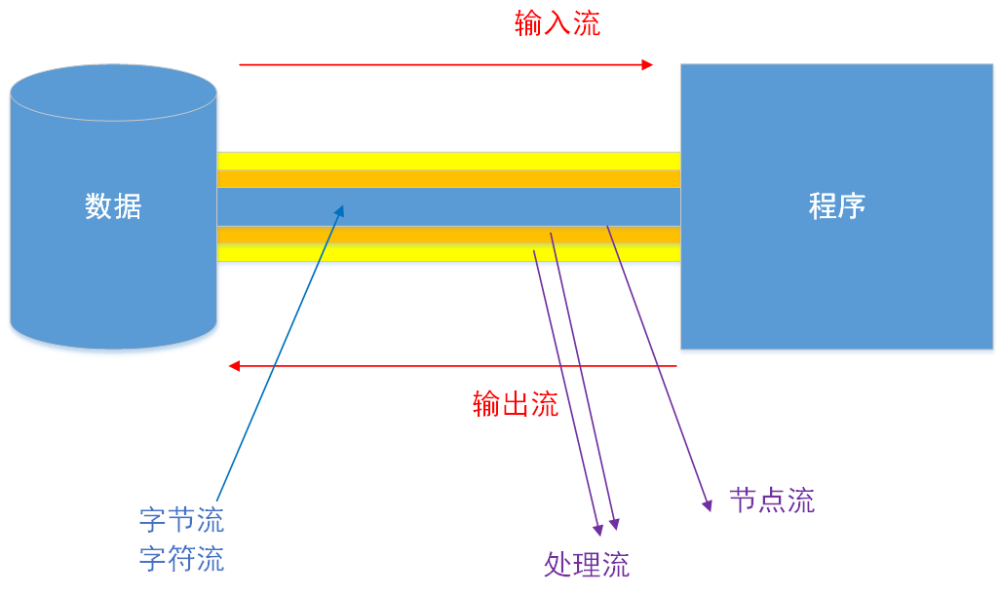

# IO流

### 流的分类

* 按照操作**数据单位**不同分为：字节流(8 bit)、字符流(16 bit)
* 按照数据流的**流向**不同分为：输入流、输出流
* 按流的**角色**的不同分为：字节流、处理流

**图示：**

**图表：**

| (抽象基类) |    字节流    | 字符流 |
| :--------: | :----------: | :----: |
|   输入流   | InputStream  | Reader |
|   输出流   | OutputStream | Writer |

**IO流体系：重点-->抽象基类、访问文件、缓冲流、转换流、对象流 | 节点流：访问文件|剩下的：处理流 ** 

|    分类    |      字节输入流      |      字节输出流       |    字符输入流     |     字符输出流     |
| :--------: | :------------------: | :-------------------: | :---------------: | :----------------: |
|  抽象基类  |     InputStream      |     OutputStream      |      Reader       |       Writer       |
|  访问文件  |   FileInputStream    |   FileOutputStream    |    FileReader     |     FileWriter     |
|  访问数组  | ByteArrayInputStream | ByteArrayOutputStream |  CharArrayReader  |  CharArrayReader   |
|  访问管道  |   PipedInputStream   |   PipedOutputStream   |    PipedReader    |    PipedReader     |
| 访问字符串 |                      |                       |   StringReader    |    StringWriter    |
|   缓冲流   | BufferedInputStream  | BufferedOutputStream  |  BufferedReader   |   BufferedWriter   |
|   转换流   |                      |                       | InputStreamReader | OutputStreamWriter |
|   对象流   |  ObjectInputStream   |  ObjectOutputStream   |                   |                    |
|            |  FilterInputStream   |  FilterOutputStream   |   FilterReader    |    FilterWriter    |
|   打印流   |                      |      PrintStream      |                   |    PrintWriter     |
| 推回输入流 | PushbackInputStream  |                       |  PushbackReader   |                    |
|   特殊流   |   DataInputStream    |   DataOutputStream    |                   |                    |

***

