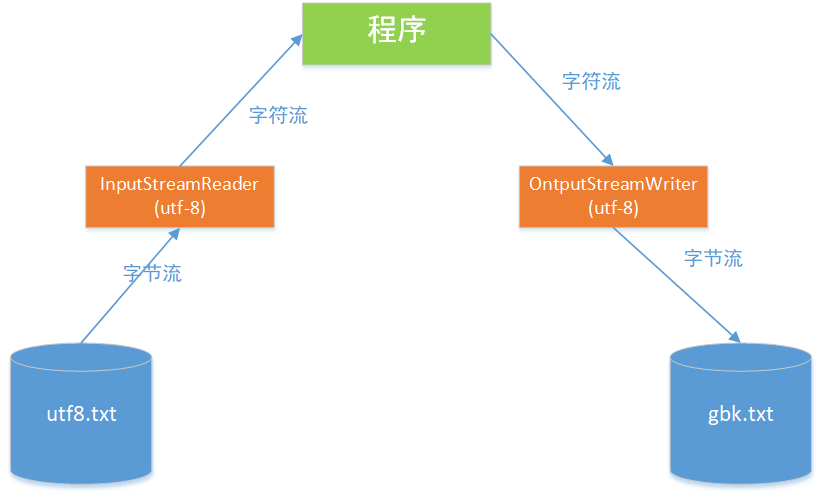

# IO流

### 文件流

* 字节流：FileInputStream、FileOutputStream
* 字符流：FileReader、FileWriter

**操作步骤：**

* 实例化File类的对象，指明要操作的文件
* 提供具体的流
* 读入（写出）的操作
* 资源的关闭

**结论：**

* 对于文本文件( .txt,java,.c,.cpp)，使用字符流处理
* 对于非文本文件( .jpg，.mp3，.mp4，.avi，.doc，.ppt....)，使用字节流处理

**字节流：FileInputStream、FileOutputStream**

```java
            //1.创建File类的对象，指明读入和写出的文件;
            File srcfile = new File("src\\day6_20\\等待.jpg");
            File destfile = new File("src\\day6_20\\等待1.jpg");

            //2.创建输入流和输出流的对象
            FileInputStream fis = new FileInputStream(srcfile);
            FileOutputStream fos = new FileOutputStream(destfile);

            //3.数据的读入和写出操作
            byte[] buffer = new byte[5];
            int len;
            while ((len = fis.read(buffer)) != -1){
                fos.write(buffer,0,len);
            }

			fos.close();
			fis.close();
```

**字符流：FileReader、FileWriter**

```java
			//1.创建File类的对象，指明读入和写出的文件
            File srcfile = new File("src\\day6_20\\hello.txt");
            File destfile = new File("src\\day6_20\\hello2.txt");

            //2.创建输入流和输出流的对象
            FileReader fr = new FileReader(srcfile);
            FileWriter fw = new FileWriter(destfile);

            //3.数据的读入和写出操作
            char[] cbuf = new char[5];
            int len;
            while ((len = fr.read(cbuf)) != -1){
                fw.write(cbuf,0,len);
            }
			fr.close();
			fw.close();
```

***

### 处理流之一：缓冲流

* 字节流：BufferedInputStream、BufferedOutputStream
* 字符流：BufferedReader、BufferedWriter

**作用：**

* 提高流的读取、写入速度
* 提高读写速度的原因：内部提供了一个缓冲区

**字节流：BufferedInputStream、BufferedOutputStream**

```java
            //1.造文件
            File srcfile = new File("src\\day6_20\\等待.jpg");
            File destfile = new File("src\\day6_21\\等待1.jpg");

            //2.造流
            //2.1 造节点流
            FileInputStream fis = new FileInputStream(srcfile);
            FileOutputStream fos = new FileOutputStream(destfile);

            //2.2 造缓冲流
            BufferedInputStream bis = new BufferedInputStream(fis);
            BufferedOutputStream bos = new BufferedOutputStream(fos);

            //3.复制的细节：读取、写入
            byte[] buffer = new byte[1024];
            int len;
            while ((len = bis.read(buffer)) != -1) {
                bos.write(buffer, 0, len);
            }
			bis.close();
			bos.close();
```

**字符流：BufferedReader、BufferedWriter**

```java
            //1,2
            BufferedReader br = new BufferedReader(new FileReader(new File("src\\day6_21\\hello.txt")));
            BufferedWriter bw = new BufferedWriter(new FileWriter(new File("src\\day6_21\\hello(copy).txt")));

            //3
            //方式一：
//            char[] buffer = new char[1024];
//            int len;
//            while ((len = br.read(buffer)) != -1){
//                bw.write(buffer,0,len);
//            }

            //方式二：使用String
            String data;
            while ((data = br.readLine()) != null) {
                //方法一
//                bw.write(data+"\n");
                bw.write(data);
                bw.newLine();
            }
			bw.close();
			br.close();
```

***

### 处理流之二：转换流(字符流)

* InputStreamReader：将一个 **字节** 的输入流转换为 **字符** 的输入流
* OutputStreamWriter：将一个 **字符** 的输出流转换为 **字节** 的输入流

**图解：**



**作用：** 提供字节流与字符流之间的转换

**解码：** **字节、字节** 数组 --> **字符** 数组、**字符** 串

**编码：** **字符** 数组、**字符** 串 --> **字节、字节** 数组 

```java
            //1.
			File file1 = new File("src\\day6_21\\hello.txt");
            File file2 = new File("src\\day6_21\\hello_gbk.txt");
			//2
            FileInputStream fis = new FileInputStream(file1);
            FileOutputStream fos = new FileOutputStream(file2);

            InputStreamReader isr = new InputStreamReader(fis, "UTF-8");
            OutputStreamWriter osw = new OutputStreamWriter(fos, "GBK");
			//3.
            char[] cbuf = new char[1024];
            int len;
            while ((len = isr.read(cbuf)) != -1) {
                osw.write(cbuf, 0, len);
            }

			//4.
			osw.close();
			isr.close();
```

***

### 处理流之三：对象流

*  ObjectInputStream 和 ObjectOutputStream
* **作用：** 用于存储和读取基本数据类型数据或对象的处理流。它的强大之处就是可以把java中的对象写入到数据中，也能把对象从数据源中还原回来
* **序列化：** 用 ObjectOutputStream 类 保存 基本类型或对象的机制
* **反序列化：** 用 ObjectInputStream 类 读取 基本类型数据或对象的机制

#### 对象类（例如：Person类）需要满足如下要求，方可序列化

* 需要实现接口：Serializable
* 需要当前类提供一个全局常量：serialVersionUID
* 除了当前Person类需要实现Serializable接口之外，还必须保证其内部所有属性也必须是可序列化的（默认情况下，基本数据类型可序列化）
* ObjectInputStream 和 ObjectOutputStream 不能序列化 static 和 transient 修饰的成员变量

##### 对象序列化

*  凡是实现Serializable接口类的都有一个表示序列化版本标识符的静态常量：
  * private static final long serialVersionUID
  * serialVersionUID用来表名类的不同版本的兼容性，简言之，其目的是以序列化对象进行版本控制，有关各版本反序列化是否兼容。
  * 如果类没有显示定义这个静态常量，它的值是java运行时环境根据类的内部细节自动生成的。若类的实例变量做了修改，serialVersionUID可能会发生变化，故建议显示声明
* 简单来说，java的序列化机制是通过运行时判断类的serialVersionUID来验证版本的一致性的，在进行反序列化时，JVM会把传来的字节流中的serialVersionUID与本地相应实体的serialVersionUID进行比较，如果相同就认为是一致的，可以进行反序列化，否则就会出现序列化版本不一致的异常（InvalidClassException）

**Person.java**

```java
public class Person implements Serializable {

    private static final long serialVersionUID = 3354231354L;

    private String name;
    private int age;

    public Person(String name, int age) {
        this.name = name;
        this.age = age;
    }

    public String getName() {
        return name;
    }

    public void setName(String name) {
        this.name = name;
    }

    public int getAge() {
        return age;
    }

    public void setAge(int age) {
        this.age = age;
    }

    @Override
    public String toString() {
        return "Person{" +
                "name='" + name + '\'' +
                ", age=" + age +
                '}';
    }

}
```

**objectTest.java**

```java
public class ObjectTest {

    /*
    序列化过程：将内存中的java对象保存到磁盘中或通过网络传输出去
    使用ObjectOutputStream实现
     */

    @Test
    public void testObjectOutputStream(){

        ObjectOutputStream oos = null;
        try {
            oos = new ObjectOutputStream(new FileOutputStream(new File("src\\day6_21\\object.lyb")));

            oos.writeObject(new String("我秋梨膏，太难了！"));
            oos.flush();

            oos.writeObject(new Person("天才小熊猫",23));
            oos.flush();

        } catch (IOException e) {
            e.printStackTrace();
        } finally {
            if (oos != null){
                try {
                    oos.close();
                } catch (IOException e) {
                    e.printStackTrace();
                }
            }
        }
    }

    /*
    反序列化：将磁盘文件中对象还原为内存的一个java对象
    使用ObjectInputStream实现
     */

    @Test
    public void testObjectInputStream(){

        ObjectInputStream ois = null;
        try {
            ois = new ObjectInputStream(new FileInputStream(new File("src\\day6_21\\object.lyb")));
            Object obj = ois.readObject();
            
            String str = (String) obj;
            Person p = (Person)ois.readObject();
            
            System.out.println(str);
            System.out.println(p);
            
        } catch (IOException e) {
            e.printStackTrace();
        } catch (ClassNotFoundException e) {
            e.printStackTrace();
        } finally {
            if (ois != null){
                try {
                    ois.close();
                } catch (IOException e) {
                    e.printStackTrace();
                }
            }
        }
    }
}
```

