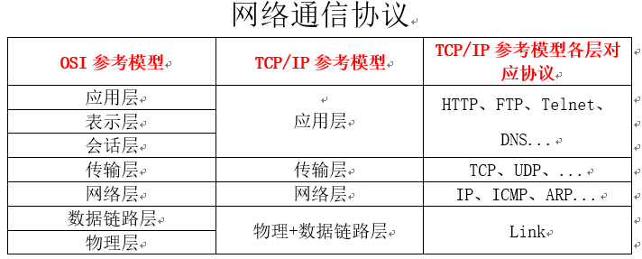
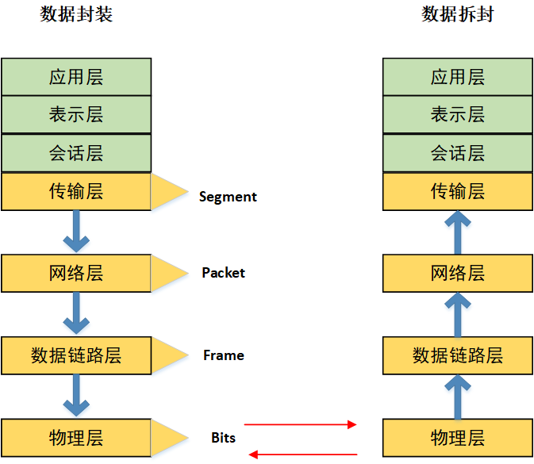
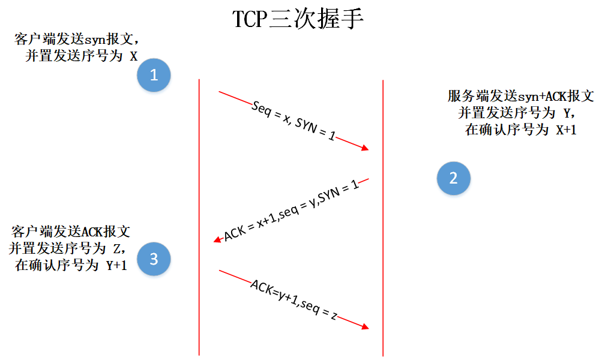
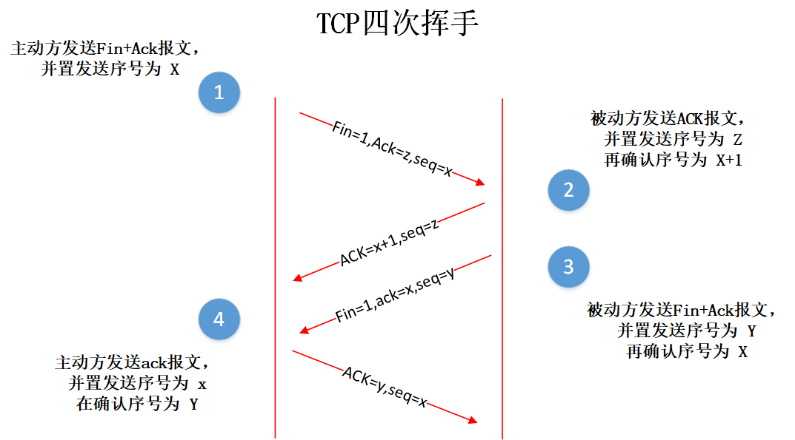

# 网络编程（前篇）

* **网络编程的目的：** 直接或间接地通过网络协议其他计算机实现数据交换，进行通讯
* **网络编程中的两个主要问题：**
  * 如何准确地定位网络上一台或多台主机；定位主机上的特定的应用
  * 找到主机后如何靠谱高效地进行数据传输
* 网络通讯要素：
  * IP和端口号
  * 网络通讯协议

#### IP和端口号

* **IP:** 唯一标识 Internet 上的计算机（通信实体）
* 在java中使用InetAddress类代表IP
* **IP分类：** IPv4 和IPv6 ；万维网 和 局域网
* 域名：www.baidu.com、......
* 如何实例化InetAddress：两个方法：getByName(String host)、getLocalHost
  * 两个常用方法：getHostName() / getHostAddress()
* **端口号：** 正在计算机上运行的进程。
  * **要求：** 不同的进程有不同的端口号
  * **范围：** 被规定为一个16位的整数
* 端口号与ip地址的组合得出一个网络套接字：Socket

#### 网络通信协议

* **概述：** 计算机网络中实现通信必须有的一些约定，即通信协议，对 **速率、传输代码、代码结构、传输控制步骤、出错控制等制定标准。** 
* **通信协议分层的思想：** 在制定协议时，把复杂成分分解成一些简单的成分，再将它们复合起来。最常用的复合方式是层次方式，即 **同层之间可以通信，上一层可以调用下一层，而与再下一层不发生关系。** 各层之间不影响，利于系统的开发和拓展。

#### TCP/IP协议簇

* 传输层协议中有两个非常重要的协议：
  * 传输控制协议 **TCP(Transmission Control Protocol)**
  * 用户数据报协议 **UDP(User Datagram Protocol)** 
* **TCP/IP以其中两个主要协议：传输控制协议（TCP）和网络互联协议（IP）** 而得名，实际上是一组协议，包括多个具有不同功能且相互为关联的协议。
* **IP（Internet Protocol）** 协议是网络层的主要协议，支持网间互连的数据通信。
* TCP/IP协议模型从更实用的角度出发，形成高效的四层体系结构，即：**物理链路层、IP层、传输层和应用层** 

#### TCP 和 UDP

* **TCP协议：可靠的数据传输（三次握手）；进行大数据量的传输；效率低**
  
  * 使用TCP协议前，须建立TCP连接，形成传输数据通道
  * 传输前，采用**“三次握手”** 方式，点对点通信，是可靠的
  * TCP协议进行通信的两个应用进程：客户端、服务端
  * 传输完毕，需要释放已建立的连接、效率低
  
* **UDP协议：不可靠；以数据报的形式发送，数据报限定为64K；效率高**
  
  * 将数据、源、目的封装成数据包，不需要建立连接
  * 每个数据报的大小限制在64K内
  * 发送不管对方是否准备好，接收方收到也不确认，故是不可靠的
  * 可以广播发送
  * 发送数据结束时无需释放资源，开销小，速度快
  
  **网络通信协议：**
  
  
  
  **数据转换：**
  
  
  
  **TCP的三次握手：**
  
  
  
  **TCP四次挥手：**
  
  
